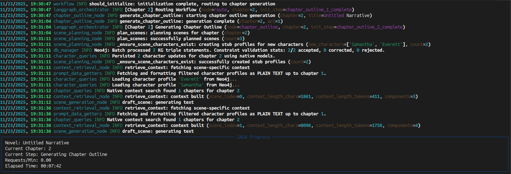
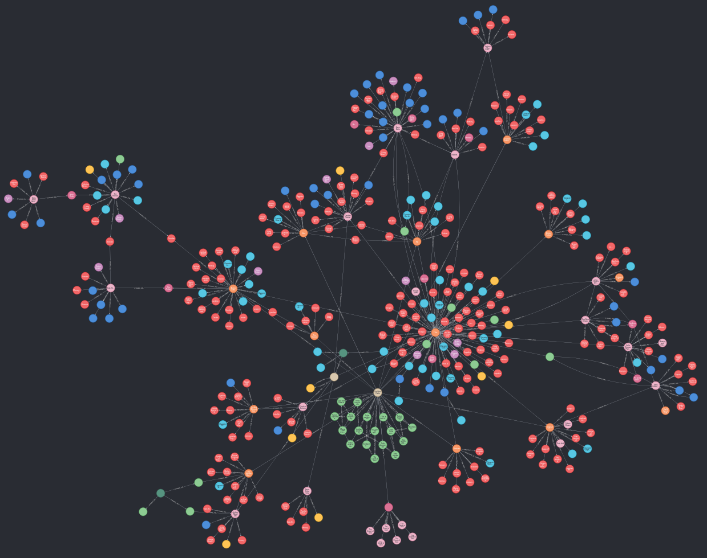

# SAGA - Semantic And Graph‑enhanced Authoring

**WARNING**: SAGA is currently in a state of (mostly) functional flux as it is undergoing a significant refactor and overhaul. Things may not work as intended.

**NOTE**: `MAX_REVISION_CYCLES_PER_CHAPTER` currently defaults to `0`, effectively disabling the revision cycle during chapter generation. It is currently broken and imminently going to be refactored.

**DEPRECATION NOTICE**: As of Phase 2, LangGraph is now the default orchestration pipeline. The legacy NANA pipeline is deprecated and will be removed in SAGA v3.0. To use the legacy NANA pipeline, run `python main.py --nana`. Please migrate to LangGraph for continued support.

SAGA is a local‑first, single‑process Python CLI that uses a Neo4j knowledge graph and a small set of cooperating agents to plan, draft, and revise long‑form fiction while preserving continuity across chapters.


## What SAGA Does

- Local knowledge graph continuity
  - Persists entities, relationships, plot points, and chapter metadata in a local Neo4j database.
  - Maintains coherence via periodic “healing/enrichment” passes and duplicate prevention/merging.
- Agentic writing pipeline
  - Plans scenes, drafts prose, and runs patch‑based revisions with automated evaluation gates.
  - Generates continuation plot points when the outline runs out, based on recent chapter summaries.
- Multi‑phase bootstrap (optional)
  - World → Characters → Plot, each with lightweight validation and optional graph healing.
  - Can run standalone or as an integrated prelude to generation.
- Semantic context and search
  - Embeddings stored on chapter nodes with a Neo4j vector index for fast similarity search.
  - “Zero‑copy” context assembly pulls just the snippets needed for the current chapter.
- Rich CLI progress
  - Live panel shows novel title, chapter progress, current step, elapsed time, and request rate.


## Quick Start

Prereqs
- Python 3.12
- Neo4j 5.x running locally (standalone or via `docker-compose`)
- A local LLM endpoint for completions and embeddings (OpenAI‑compatible HTTP, e.g., local gateway). Configure endpoints in `.env`.

*Note: SAGA also supports connecting to cloud endpoints as well, but is local-first by design.*

Setup
```bash
python -m venv .venv && source .venv/bin/activate
pip install -r requirements.txt
cp .env.example .env   # then edit values as needed
```

Start Neo4j (optional helper)
```bash
docker-compose up -d   # uses docker-compose.yml in this repo
```

Run the generator (uses LangGraph workflow by default)
```bash
python main.py
```

Run with legacy NANA pipeline (deprecated)
```bash
python main.py --nana
```

Optional: Run the bootstrap independent of the novel generation cycle (world → characters → plot)
```bash
# Full pipeline
python main.py --bootstrap

# Limit to a phase
python main.py --bootstrap --bootstrap-phase world     # or characters|plot

# Tuning and safety
python main.py --bootstrap --bootstrap-level basic     # basic|enhanced|max
python main.py --bootstrap --bootstrap-dry-run
python main.py --bootstrap --bootstrap-kg-heal
python main.py --bootstrap --bootstrap-reset-kg
```

Optional: Ingest existing text (experimental)
```bash
python main.py --ingest path/to/novel.txt
```


## Key Features

- Knowledge Graph backbone (Neo4j)
  - Schema creation with constraints/indexes, including a vector index on chapter embeddings.
  - Entity merge helpers and enrichment to reduce duplication and fill gaps over time.
- Agents, not services
  - NarrativeAgent: scene planning and chapter drafting using KG‑aware context.
  - RevisionAgent: evaluation + small, targeted patch cycles to improve drafts.
  - KnowledgeAgent: KG extraction/persistence, healing/enrichment, and outline sync.
- Continuation planning
  - When all concrete plot points are used, SAGA plans additional points from prior summaries.
- Output artifacts
  - Chapter text files, per‑chapter logs, and debug JSON under `output/`.
- Local‑first architecture
  - No web servers or distributed components; single user on a single machine.


## CLI Overview

`python main.py` — start the chapter generation loop (uses LangGraph workflow by default).

`python main.py --nana` — use legacy NANA pipeline (deprecated; will be removed in v3.0).

`python main.py --bootstrap [options]` — run the multi‑phase bootstrap and exit.
- `--bootstrap-phase {world|characters|plot|all}`
- `--bootstrap-level {basic|enhanced|max}`
- `--bootstrap-dry-run` (validate only; do not write to Neo4j)
- `--bootstrap-kg-heal` (heal/enrich after each phase write)
- `--bootstrap-reset-kg` (wipe Neo4j before bootstrapping; destructive)

`python main.py --ingest <file>` — ingest a text file into the KG (experimental; requires `--nana` flag).


## Configuration

- Edit `.env` or adjust `config/settings.py`. Important keys:
  - `OPENAI_API_BASE`, `OPENAI_API_KEY` — OpenAI‑compatible completion endpoint (local recommended)
  - `EMBEDDING_API_BASE`, `EMBEDDING_MODEL`, `EXPECTED_EMBEDDING_DIM` — embedding service and dimensions
  - `NEO4J_URI`, `NEO4J_USER`, `NEO4J_PASSWORD` — local Neo4j connection
  - `CHAPTERS_PER_RUN`, `CONTEXT_CHAPTER_COUNT`, `TARGET_PLOT_POINTS_INITIAL_GENERATION` — core behavior
  - Bootstrap toggles: `BOOTSTRAP_*` settings (healing, levels, fail‑fast, etc.)

Outputs are written under `output/`:
- `output/chapters/` — final chapter text
- `output/chapter_logs/` — chapter‑specific logs
- `output/debug_outputs/` — saved prompts, scene plans, validation reports, etc.


## How It Works (High Level)

1) Bootstrap (optional, independent loop)
- Generate a minimal world, a cast of characters, and a plot outline; validate and persist to the KG.

2) Per‑chapter loop
- Build KG‑aware context (recent summaries, reliable facts, relevant world/character snippets).
- Plan scenes, draft prose, evaluate, and apply small patch cycles if needed.
- Save chapter text, summary, and embedding; periodically heal/enrich the graph.

3) Continuation
- If the outline runs out of concrete plot points, generate more from recent narrative context.


## Screenshots

Progress window (Rich CLI):



Example KG snapshot (4 chapters):




## Light Dev Notes

- Single user, single machine; no web servers or remote services are introduced by SAGA.
- Run tests with `pytest`; lint/format with `ruff check .` and `ruff format .`.


## License

Apache-2.0 — see `LICENSE`.
