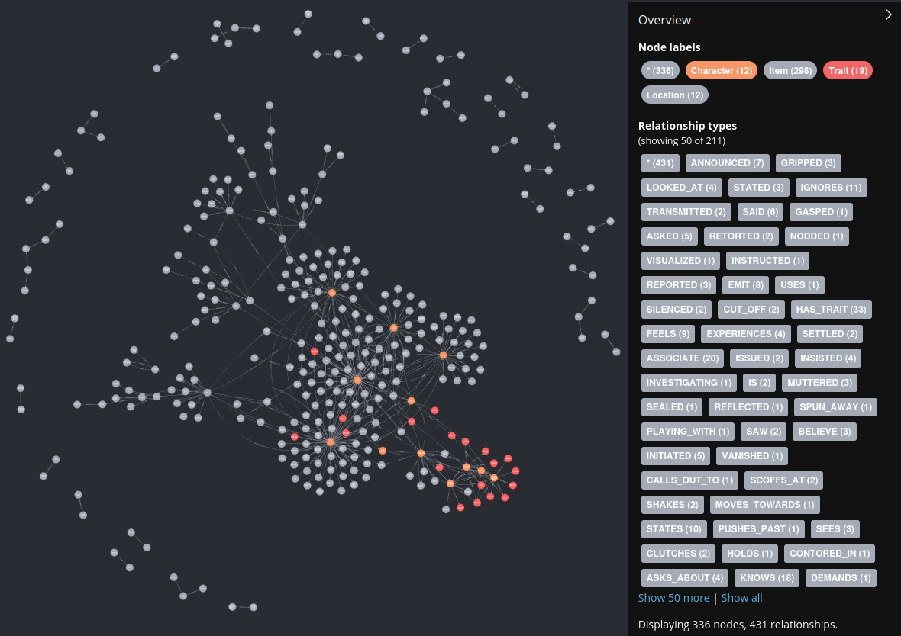

# SAGA

SAGA (Semantic And Graph-enhanced Authoring) is a **local-first**, single-user Python CLI for **AI-driven long-form fiction generation**. It uses:

- **LangGraph** for workflow orchestration (checkpointed, resumable)
- **Neo4j** as a persistent knowledge graph to store canon (characters, locations, relationships, events)
- The local filesystem for human-readable artifacts and outputs

Core philosophy: single machine, no web app, no microservices (see `docs/PROJECT_CONSTRAINTS.md`).

## For writers: what you get

SAGA's goal is to help you generate a novel while staying consistent with established story facts.

Running it produces (under `projects/{story_title}/`):

- Drafted and finalized chapters (`projects/{story_title}/chapters/`)
- Chapter summaries (`projects/{story_title}/summaries/`)
- Exportable compiled manuscript (`projects/{story_title}/exports/`)
- Human-readable YAML artifacts (`projects/{story_title}/characters/`, `projects/{story_title}/world/`, `projects/{story_title}/outline/`)
- Resumable workflow checkpoints (`projects/{story_title}/.saga/checkpoints.db`)

The intended design is: **your canon lives in Neo4j**, while **your artifacts live in files**, so you can inspect and version outputs easily.

## Status: not production-ready

SAGA currently has known critical issues and is **not production-ready**.

## Screenshots

Progress window (Rich CLI):


Example KG snapshot (5 chapters):



## Developer quickstart

### Prerequisites

- Python **3.12** (see `pyproject.toml`)
- A running Neo4j instance (Docker is provided via `docker-compose.yml`)
- A local OpenAI-compatible LLM endpoint (for text generation)
- A local embeddings endpoint

### Setup

```bash
python -m venv .venv && source .venv/bin/activate
pip install -r requirements.txt
cp .env.example .env
```

Edit your `.env` to match your local services (see `.env.example`).

### Start Neo4j (Docker)

```bash
docker-compose up -d
```

Neo4j defaults in this repo:
- user: `neo4j`
- password: `saga_password`

### Run SAGA

```bash
python main.py
```

## Configuration

SAGA uses Pydantic settings loaded from `.env` (see `config/settings.py`).

Key environment variables (examples in `.env.example`):

- `OPENAI_API_BASE`: OpenAI-compatible base URL (example: `http://127.0.0.1:8080/v1`)
- `OPENAI_API_KEY`: token (can be dummy for purely local gateways)
- `EMBEDDING_API_BASE`: embeddings endpoint base URL (example: `http://127.0.0.1:11434`)
- `EMBEDDING_MODEL`: embedding model name
- `EXPECTED_EMBEDDING_DIM` and `NEO4J_VECTOR_DIMENSIONS`: must match your embedding model's output dimension

Important:
- Defaults in `config/settings.py` assume a **1024-dim** embedding model unless overridden.
- The sample `.env.example` uses **768**.

Keep embedding dimensions consistent across:
`EXPECTED_EMBEDDING_DIM`, `NEO4J_VECTOR_DIMENSIONS`, and your embedding model.

## Local LLM endpoint examples

SAGA assumes generation is done via an **OpenAI-compatible HTTP API** on your machine (configured via `OPENAI_API_BASE`).

Common local patterns:

- **vLLM (OpenAI-compatible server)**  
  Run vLLM in OpenAI server mode and point `OPENAI_API_BASE` at it.

- **llama.cpp server (OpenAI-compatible)**  
  Run llama.cpp's server mode and point `OPENAI_API_BASE` at it.

- **OpenAI-compatible gateways (local)**  
  If you run a local gateway that exposes `/v1` endpoints, point `OPENAI_API_BASE` at the gateway.

Embeddings are configured separately via `EMBEDDING_API_BASE`. Any embedding service that matches your configured model and dimension works.

## Outputs

High-level output layout:

```
projects/{story_title}/
├── .saga/
│   ├── checkpoints.db          # LangGraph SQLite checkpoints
│   ├── logs/                   # Runtime logs per chapter
│   └── content/                # Externalized content (blobs)
│       ├── drafts/
│       ├── outlines/
│       ├── summaries/
│       ├── extractions/
│       └── embeddings/
├── chapters/            # Finalized chapters (markdown)
│   └── chapter_01.md
├── summaries/           # Per-chapter summaries
│   └── chapter_01_summary.txt
├── outline/             # Story/act/chapter outline YAML
│   ├── structure.yaml          # Global act/plot structure
│   └── beats.yaml              # Detailed outline per act/chapter
├── characters/          # Character profiles YAML
│   └── protagonist.yaml
├── world/               # World items + rules YAML
│   └── items.yaml
└── exports/             # Compiled manuscript exports
    └── novel_full.md
```

## How it works (high level)

SAGA uses a two-phase workflow:

### 1. Initialization Phase
Runs once per project to establish the narrative foundation:
- Generate character sheets for main characters
- Create a global outline with act structure (3 or 5 acts)
- Expand into detailed act outlines with chapter-level beats
- Commit initialization to Neo4j knowledge graph
- Persist artifacts as YAML/Markdown files

### 2. Generation Loop (Chapter-by-Chapter)
Repeats for each chapter:

1. **Chapter Planning**: Generate a detailed scene-by-scene outline
2. **Scene-level Generation**:
   - Plan scenes from the chapter outline
   - Retrieve relevant context from Neo4j (characters, relationships, events)
   - Generate prose for each scene individually
3. **Extraction**: Extract entities and relationships from each scene, then consolidate
4. **Embedding Generation**: Create vector embeddings for the chapter
5. **Relationship Normalization**: Map extracted relationships to canonical types
6. **Commit to Graph**: Persist extracted information to Neo4j with deduplication
7. **Validation**:
   - Consistency checks (relationship validation, trait consistency, plot advancement)
   - LLM-based quality evaluation (coherence, prose quality, pacing, tone)
   - Contradiction detection (abrupt relationship changes, timeline issues)
8. **Revision Loop**: If validation fails, revise the chapter and re-enter extraction
9. **Finalization**: Generate summary, write final markdown, perform graph healing
10. **Quality Assurance**: Final checks before advancing to next chapter

### Key Features

- **Scene-level generation**: Chapters are broken into scenes, each generated with relevant context from the knowledge graph
- **Content externalization**: Large text blobs stored on disk via `ContentRef` to keep checkpoints lightweight
- **Graph healing**: Automated maintenance to merge duplicates and enrich provisional nodes
- **LLM-based quality evaluation**: Automatic scoring of coherence, prose quality, pacing, and tone
- **Extended contradiction detection**: Relationship evolution checks and graph consistency validation

For the deep dive, start here:
- Architecture overview: `docs/langgraph-architecture.md`
- Workflow walkthrough: `docs/WORKFLOW_WALKTHROUGH.md`
- Workflow visualization tooling: `docs/WORKFLOW_VISUALIZATION.md`

## Troubleshooting

- Logs and debug artifacts:
  - Check `projects/{story_title}/.saga/logs/` and `projects/{story_title}/.saga/content/`
- Neo4j reset (destructive):
  - Run `python reset_neo4j.py`
- Neo4j connection failures:
  - Confirm `NEO4J_URI`, `NEO4J_USER`, `NEO4J_PASSWORD` match `.env.example`

## License

Apache-2.0 - See `LICENSE`.

[](https://deepwiki.com/Lanerra/saga)