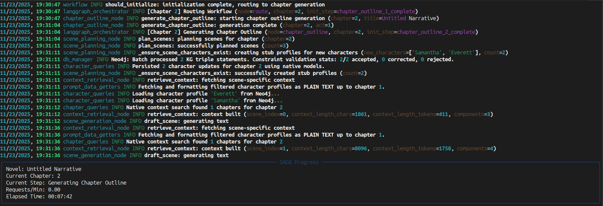
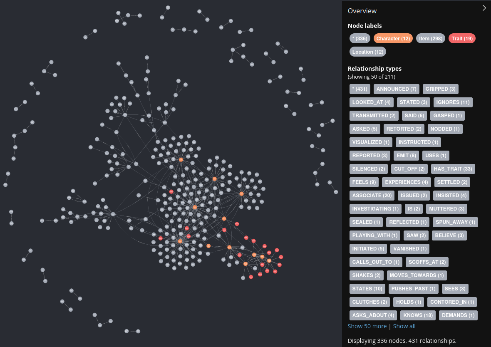

# SAGA

SAGA (Semantic And Graph-enhanced Authoring) is a **local-first**, single-user Python CLI for **AI-driven long-form fiction generation**. It uses:

- **LangGraph** for workflow orchestration (checkpointed, resumable)
- **Neo4j** as a persistent knowledge graph to store canon (characters, locations, relationships, events)
- The local filesystem for human-readable artifacts and outputs

This is the maintained operational guide. Core philosophy: single machine, no SAGA
web app or microservices (see [project constraints](docs/PROJECT_CONSTRAINTS.md)).
Local Neo4j/Bolt and model HTTP processes are dependencies, not embedded Python databases.

## For writers: what you get

SAGA's goal is to help you generate a novel while staying consistent with established story facts.

Running it produces (under `projects/{story_title}/`):

- Drafted and finalized chapters (`projects/{story_title}/chapters/`)
- Chapter summaries (`projects/{story_title}/summaries/`)
- Exportable compiled manuscript (`projects/{story_title}/exports/`)
- Human-readable YAML artifacts (`projects/{story_title}/characters/`, `projects/{story_title}/world/`, `projects/{story_title}/outline/`)
- Resumable workflow checkpoints (`projects/{story_title}/checkpoints/saga.db`)

The intended design is: **your canon lives in Neo4j**, while **your artifacts live in files**, so you can inspect and version outputs easily.

## Status: not production-ready

SAGA currently has known critical issues and is **not production-ready**.

Repair verification is source-level and synthetic unless explicitly stated otherwise.
The locked Linux runtime has prior clean-install/dependency-check evidence. Writer
command parsing and deterministic bootstrap/promotion/resume/export fixtures have
been exercised offline; that does not establish model-generated novel quality.
The `quick` entrypoint smoke covers failure propagation, not a successful novel.
Statistical spaCy weights, fresh operator environment setup, credential configuration,
Neo4j service startup/backup/restore and the configured-model authoring baseline
remain separate, unverified obligations here. Do not infer that every command below
was run by the repair worker or that the repository is release-ready.

## Screenshots

Progress window (Rich CLI):



Example KG snapshot (5 chapters):



## Developer quickstart

### Prerequisites

- Linux x86-64 with CPython **3.12.13** (pinned in `.python-version`; Ruff/Mypy target Python 3.12)
- `uv` **0.11.21** for interpreter installation and dependency locking
- A running Neo4j instance (Docker is provided via `docker-compose.yml`)
- A local OpenAI-compatible LLM endpoint (for text generation)
- A local embeddings endpoint

### Setup

```bash
uv python install 3.12.13 --no-bin
uv venv --python 3.12.13 --managed-python .venv-runtime
uv pip sync --python .venv-runtime/bin/python --require-hashes --only-binary :all: requirements.lock
.venv-runtime/bin/python -m pip check
source .venv-runtime/bin/activate
cp -n .env.example .env
```

Edit your `.env` to match your local services (see `.env.example`).
The copy command preserves an existing `.env`; never replace credentials on retry.

Use a fresh destination for environment creation. Do not replace or delete an existing
`.venv` while its recoverability is unresolved. The repair campaign uses its own
runtime rather than either repository environment; only its runtime owner installs packages.

`requirements.txt` is the direct-pin resolver input, not the supported installation
command. `requirements.lock` pins and SHA-256-verifies the full Linux Python 3.12
dependency closure, including pip, pytest/asyncio/coverage/timeout, Ruff, Mypy and
aiofiles/PyYAML type stubs. It does not install SAGA as an editable package or install
GPU libraries. Other platforms and Python versions are not verified.

To check or deliberately refresh the lock with the supported interpreter, constrain
resolution to the existing lock so unchanged dependencies do not drift:

```bash
uv pip compile requirements.txt --constraint requirements.lock \
  --python .venv-runtime/bin/python --python-platform x86_64-unknown-linux-gnu \
  --generate-hashes --no-emit-index-url --no-header --no-annotate \
  --output-file requirements.candidate.lock
cmp requirements.lock requirements.candidate.lock
```

An intentional version change requires updating its direct pin and reviewing the
corresponding constraint change before resolving. Inspect the candidate, install it
into a separate fresh environment, then run `python -m pip check` and the runtime
regressions before promoting it. A successful `pip check` alone does not prove imports
work: spaCy 3.8.7 also requires the explicitly pinned Click compatibility dependency.
The audit's `runtime-freeze.txt` is historical evidence, not an install manifest.

### spaCy model setup (explicit, separate from the runtime lock)

The default statistical pipeline is `en_core_web_lg`. The library lock does not include
model weights, and CLI help does not require them. Install the compatible **3.8.0**
model explicitly when preparing an authoring environment with network access:

```bash
python -m pip install --no-deps \
  https://github.com/explosion/spacy-models/releases/download/en_core_web_lg-3.8.0/en_core_web_lg-3.8.0-py3-none-any.whl
python -m pip check
python -c 'import spacy; pipeline = spacy.load("en_core_web_lg"); assert pipeline.meta["version"] == "3.8.0"; print(pipeline.pipe_names)'
```

`--no-deps` preserves the locked library versions. For air-gapped setup, download
that exact wheel on a connected machine, record and verify its SHA-256 during transfer,
then install the local wheel with `--no-index --no-deps`. Model wheels are a separate
resource, not covered by the library lock's hashes; syncing only `requirements.lock`
removes the optional model package. Do not run model download commands automatically
at application startup or in unit fixtures. `SPACY_MODEL` selects a deliberately
installed alternative; the small model does not provide the large model's vectors.

### Runtime verification

Use the selected runtime's absolute interpreter path and an explicit `PYTHONPATH`
pointing to the intended worktree. Run application checks from fresh synthetic
working/output/cache directories, without personal `.env` files, and deny network
and subprocess execution before importing SAGA. Offline environment flags alone
are not a network boundary. The campaign runtime receipt supplies the denied-network
harness and exact reusable commands; it accepts a selected worktree and a worker-local
scratch parent, with no installs by consumers.

With pytest plugin autoload disabled, load entry-point names `-p asyncio -p pytest_cov
-p timeout` (not their module paths), so pytest can validate the required plugin
distributions. `tests/test_runtime_dependencies.py` checks the declarations, hashed
lock and a blank spaCy pipeline without downloading statistical models. Existing
model-dependent spaCy cases require separate fixture/integration treatment; do not
silently skip them or interpret the runtime smoke as a green full unit suite.

### Start disposable Neo4j (optional Docker example)

The supplied Compose file is a **disposable example**, not a durable story deployment:
it has no persistent `/data` volume and publishes ports without a loopback-only bind.
Do not use it for real stories as-is, remove an existing container, or run it against
an occupied service port. Operator-reviewed persistent storage, local-only binding,
credentials and a restore-tested backup are prerequisites for real authoring.
The following command requires a separately installed `docker-compose` executable
and has not been exercised by this repair worker:

```bash
docker-compose up -d
```

Neo4j defaults in this repo:
- user: `neo4j`
- password: `saga_password`

### Run SAGA's bootstrap mode with a high-level plot specification

```bash
python main.py bootstrap "A suspenseful thriller set inside a deep-sea facility at the bottom of the ocean"
```

Review `projects/{story_title}/config.candidate.json` before accepting the generated
metadata. Use the exact project path printed by bootstrap. A title whose normalized
directory already exists is rejected without overwriting it; choose a distinct title
for a new project. An interrupted config publication can leave a reserved directory,
but never authorizes overwriting it on retry.

### Start SAGA's generation mode using the information from bootstrap mode

```bash
python main.py generate --project-dir "projects/{story_title}" --from-candidate
```

`--from-candidate` validates and promotes only that project's candidate. It refuses
to replace an existing `config.json`. For subsequent continuation, omit the flag:

```bash
python main.py generate --project-dir "projects/{story_title}"
```

Selection is mandatory: SAGA does not choose the newest project or auto-promote an
unrelated candidate. Generation uses the selected project's native checkpoint and
reconciles graph ownership and retained artifacts. It initializes only fresh state;
it does not reset checkpoints, delete files, or clear Neo4j. A successful invocation
is not necessarily a complete manuscript: the terminal summary reports the actual
checksum-verified accepted chapter count. Failures exit 1 and cancellations exit 130;
both can retain partial progress. Resume the same project, not a replacement project.

Neo4j ownership is exclusive to one project per configured database. Keep that
project's `graph-project-id`, files and checkpoints together. A copied identity is
a restore of the same story, not a new story fork. A new title or directory is not
permission to adopt an occupied or legacy database. Ownership/resume conflicts
require reconciliation, not a reset or removal of the identity file.

### SAGA can also be started directly with the high-level plot specification to auto-accept LLM choices

```bash
python main.py quick "A suspenseful thriller set inside a deep-sea facility at the bottom of the ocean"
```

### Export the complete accepted manuscript

```bash
python main.py export --project-dir "projects/{story_title}"
python main.py --help
```

Export requires exactly the configured chapters, numbered from 1 without gaps, and
checksum-valid accepted manuscript receipts. Drafts and compatibility mirrors never
supply prose. Bodies are preserved byte-for-byte, joined with two separator newlines
and one terminal newline only when needed. The success summary names the emitted
chapters and `exports/novel_full.md`. Empty, missing, corrupt or duplicate identities
fail before replacing the export. Historical unreceipted prose is not silently adopted.

## Configuration

SAGA uses Pydantic settings loaded from `.env` (see `config/settings.py`).

Key environment variables (examples in `.env.example`):

- `OPENAI_API_BASE`: OpenAI-compatible base URL (example: `http://127.0.0.1:8080/v1`)
- `OPENAI_API_KEY`: token (can be dummy for purely local gateways)
- `EMBEDDING_API_BASE`: embeddings endpoint base URL (example: `http://127.0.0.1:11434`)
- `EMBEDDING_MODEL`: embedding model name
- `EXPECTED_EMBEDDING_DIM` and `NEO4J_VECTOR_DIMENSIONS`: must match your embedding model's output dimension

Important:
- Defaults in `config/settings.py` assume a **1024-dim** embedding model unless overridden.
- The sample `.env.example` uses **768**.

Keep embedding dimensions consistent across:
`EXPECTED_EMBEDDING_DIM`, `NEO4J_VECTOR_DIMENSIONS`, and your embedding model.

## Local LLM endpoint expectation

SAGA assumes generation is done via an **OpenAI-compatible HTTP API** (configured via `OPENAI_API_BASE`).

Embeddings are configured separately via `EMBEDDING_API_BASE`. Any embedding service that matches your configured model and dimension works.

## Outputs

High-level output layout:

```
projects/{story_title}/
├── .saga/
│   └── content/                # Externalized content (blobs)
│       ├── drafts/
│       ├── chapter_outlines/
│       ├── summaries/
│       ├── extracted_entities/
│       └── scene_embeddings/
├── graph-project-id            # Exclusive graph identity; preserve on restore
├── checkpoints/
│   └── saga.db                 # LangGraph SQLite checkpoints
├── chapters/
│   ├── .manuscripts/           # Retained canonical Markdown and prepared receipts
│   ├── chapter_001.accepted.json # Checksum-bound accepted selection
│   └── chapter_001.md          # Compatibility mirror, not export authority
├── summaries/           # Per-chapter summaries
│   └── chapter_001.md
├── outline/             # Story/act/chapter outline YAML
│   ├── structure.yaml          # Global act/plot structure
│   └── beats.yaml              # Detailed outline per act/chapter
├── characters/          # Character profiles YAML
│   └── protagonist.yaml
├── world/               # World items + rules YAML
│   └── items.yaml
└── exports/             # Compiled manuscript exports
    └── novel_full.md
```

This layout shows representative generated artifacts, not a template to create by
hand. Bootstrap first produces `config.candidate.json`; acceptance publishes
`config.json`. Runtime logs follow `LOG_FILE` under `BASE_OUTPUT_DIR` (or console
only in simple logging mode), not a guaranteed per-project `.saga/logs/` directory.

## How it works (high level)

SAGA uses a two-phase workflow:

### 1. Initialization Phase
Runs once per project to establish the narrative foundation:
- Generate character sheets for main characters
- Create a global outline with act structure (3 or 5 acts)
- Expand into detailed act outlines with chapter-level beats
- Commit initialization to Neo4j knowledge graph
- Persist artifacts as YAML/Markdown files

### 2. Generation Loop (Chapter-by-Chapter)
Repeats for each chapter:

1. **Chapter Planning**: Generate a detailed scene-by-scene outline
2. **Scene-level Generation**:
   - Plan scenes from the chapter outline
   - Retrieve relevant context from Neo4j (characters, relationships, events)
   - Generate prose for each scene individually
3. **Extraction**: Extract entities and relationships from each scene, then consolidate
4. **Embedding Generation**: Create and validate vector embeddings for scenes
5. **Relationship Normalization**: Map extracted relationships to canonical types
6. **Commit to Graph**: Stage the chapter attempt in Neo4j under lifecycle ownership
7. **Validation**:
   - Consistency checks (relationship validation, trait consistency, plot advancement)
   - LLM-based quality evaluation (coherence, prose quality, pacing, tone)
   - Contradiction detection (abrupt relationship changes, timeline issues)
8. **Revision Loop**: On a recoverable rejection, revise and return to scene generation.
   Failed/incomplete evaluation cannot become acceptance. Strict policy also rejects
   exhausted low-quality revisions; author policy has explicit continuation rules.
9. **Finalization**: Generate summary and publish checksum-bound accepted manuscript
10. **Maintenance**: Graph healing and graph quality checks precede chapter advancement

Graph transactions, manuscript publication and SQLite checkpoints are distinct
persistence boundaries, not one cross-store atomic transaction. Recovery reconciles
retained attempts/receipts with the native checkpoint. Do not patch a saved checkpoint
to fit current configuration or treat compatibility chapter files as accepted canon.
See [quality acceptance](docs/quality-acceptance.md) for the distinction between
evaluated narrative quality and optional graph maintenance.

### Key Features

- **Scene-level generation**: Chapters are broken into scenes, each generated with relevant context from the knowledge graph
- **Content externalization**: Large text blobs stored on disk via `ContentRef` to keep checkpoints lightweight
- **Graph healing**: Automated maintenance to merge duplicates and enrich provisional nodes
- **LLM-based quality evaluation**: Automatic scoring of coherence, prose quality, pacing, and tone
- **Extended contradiction detection**: Relationship evolution checks and graph consistency validation
- **Bootstrap capability**: Converts high-level prompts into structured project configurations via `python main.py bootstrap "A western about a robot sheriff"`, with optional review step before generation

### Current source map

- [CLI](main.py), [project configuration](core/project_config.py) and
  [project manager](core/project_manager.py): explicit project selection and create-only config
- [Orchestrator](orchestration/langgraph_orchestrator.py), [workflow](core/langgraph/workflow.py)
  and [state](core/langgraph/state.py): fresh initialization, validated handoff and native resume
- [Initialization](core/langgraph/initialization/), [nodes](core/langgraph/nodes/) and
  [subgraphs](core/langgraph/subgraphs/): scene-based workflow stages
- [Lifecycle](core/langgraph/chapter_lifecycle.py), [manuscripts](core/langgraph/manuscript.py)
  and [content store](core/langgraph/content_manager.py): retained attempt and file boundaries
- [Database manager](core/db_manager.py), [graph ownership](core/graph_ownership.py)
  and [queries](data_access/): project-bound graph operations
- [Run services](core/service_context.py), [LLM interface](core/llm_interface_refactored.py),
  [embedding service](core/entity_embedding_service.py) and [prompts](prompts/): model access

### Offline workflow visualization

Run from the repository root with the selected runtime. These commands compile and
inspect the graph without invoking authoring nodes or a model. Use a fresh output
path: visualization exports replace a file at the explicitly selected destination.

```bash
python visualize_workflow.py --help
python visualize_workflow.py --workflow full --summary
python visualize_workflow.py --workflow full --output workflow_full.mmd
python visualize_workflow.py --workflow full --format ascii --output workflow_full.txt
```

PNG export is disabled: LangChain's default Mermaid PNG path calls an external
renderer, not local Graphviz. No automatic renderer installation or network fallback
is permitted. The Mermaid source or text summary is the offline deliverable.

### Contributor checks

See the [test boundary guide](tests/README.md), [AGENTS.md](AGENTS.md)
and [CLAUDE.md](CLAUDE.md) for Python/pytest contributor conventions.
The zero-error Mypy requirement covers maintained application code, tests and
operational tooling. Frozen evidence under `docs/audits/2026-09-06/` is excluded
from recursive maintained-code checking and remains unchanged; its historical
diagnostics are reported separately, not treated as maintained-code failures.
With the locked runtime selected, run from the intended repository root:

```bash
PYTHONDONTWRITEBYTECODE=1 python -m pytest -p no:cacheprovider tests/test_operational_tools.py tests/test_writer_cli.py tests/core/langgraph/test_visualization.py
PYTHONDONTWRITEBYTECODE=1 python -m mypy .
```

Pytest installs synthetic configuration and denies external I/O before application
imports. The repair campaign additionally requires its launcher filesystem sandbox
and OS-level network denial. Tests use disposable lane-local storage; they are not
permission to open real stories, credentials, or a live graph. Test functions and
files use pytest's `test_` / `test_*.py` discovery conventions.

### Historical references

These are preserved history, not current commands, repair status or release approval:

- [Architecture reference (2026-02-13)](docs/langgraph-architecture.md)
- [Codebase audit (2026-02-15)](docs/CODEBASE_AUDIT_REPORT.md)
- [Field audit (2026-05-05)](docs/field-audit-20260505.md)
- [Pre-repair current-state audit](docs/CURRENT_STATE_AUDIT.md)
- [Frozen audit (2026-09-06)](docs/audits/2026-09-06/README.md)

The frozen audit's original findings and counts are intentionally unchanged.

## Troubleshooting

- Logs and debug artifacts:
  - Check the configured `LOG_FILE`/console and `projects/{story_title}/.saga/content/`.
- Retired destructive utilities:
  - `reset_neo4j.py` rejects all reset requests before loading settings or connecting;
    even the legacy `--force` option cannot enable it. Database-wide reset cannot
    prove project scope or coordinate retained files/checkpoints. This is deliberately
    not a functioning reset command, nor a resume repair.
  - `cleanup.sh` exits 2 without deleting anything. Arbitrary cwd recursion and a
    `__pycache__` name cannot prove ownership. Prevent new bytecode with
    `PYTHONDONTWRITEBYTECODE=1`; use an independently reviewed, exact-target maintenance
    procedure for existing caches rather than recursive project/environment deletion.
- Neo4j connection failures:
  - Confirm `NEO4J_URI`, `NEO4J_USER`, `NEO4J_PASSWORD` match `.env.example`

## License

Apache-2.0 - See `LICENSE`.

[](https://deepwiki.com/Lanerra/saga)