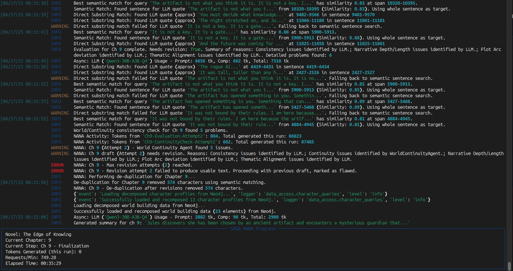

# SAGA - Semantic And Graph‑enhanced Authoring

**NOTE**: `MAX_REVISION_CYCLES_PER_CHAPTER` currently defaults to `0`, effectively disabling the revision cycle during chapter generation. It is currently broken and imminently going to be refactored.

**SAGA** is a local‑first, single‑process Python CLI that uses **LangGraph workflow orchestration** with a Neo4j knowledge graph to plan, draft, and revise long‑form fiction while preserving continuity across chapters.

## What SAGA Does

### LangGraph Workflow Orchestration
- **Declarative graph-based workflow** with 15 specialized nodes
- **Automatic state persistence** via LangGraph checkpointing (replaces 3,400+ lines of custom orchestration)
- **Resume from interruption** without data loss through SQLite-based checkpointing
- **Conditional routing** for initialization vs. generation workflows
- **Built-in parallelism** for entity extraction (5 parallel extractions)
- **Visual debugging** through graph visualization tools

### Knowledge Graph Continuity
- Persists entities, relationships, plot points, and chapter metadata in a local Neo4j database
- Maintains coherence via duplicate prevention/merging
- **Entity deduplication** with fuzzy matching + embeddings
- **Relationship validation** and constraint enforcement
- **Vector index** for semantic similarity search

### Initialization Framework (First Run Only)
- **Character sheets**: Generates 3-5 detailed character profiles via LLM
- **Global outline**: Creates 3 or 5-act story structure
- **Act outlines**: Generates detailed chapter breakdowns per act
- **On-demand chapter outlines**: Creates scene-specific outlines during generation
- **Human-readable YAML files**: `characters/`, `outline/`, `world/`

### Quality Assurance Pipeline
- **Chapter generation** with KG-aware context building
- **Entity extraction** (characters, locations, events, objects, relationships)
- **Consistency validation** with contradiction detection
- **Revision loops** with configurable iteration limits
- **Chapter summarization** for future context

### Rich CLI Experience
- **Live progress tracking** with Rich panels
- **Event streaming** for real-time node status
- **Chapter-by-chapter progress** with elapsed time and request rates
- **Detailed logging** with structured output

## Quick Start

### Prerequisites
- Python 3.12+
- Neo4j 5.x running locally (standalone or via `docker-compose`)
- A local LLM endpoint (OpenAI‑compatible HTTP, e.g., Ollama, vLLM)
- Configure endpoints in `.env`

*Note: SAGA is local-first by design, but supports cloud endpoints via configuration.*

### Setup
```bash
# Clone and setup
git clone https://github.com/Lanerra/saga
cd saga

# Create virtual environment
python -m venv .venv && source .venv/bin/activate
pip install -r requirements.txt

# Configure environment
cp .env.example .env   # Edit values as needed
```

### Start Neo4j
```bash
# Using Docker (recommended)
docker-compose up -d
```

### Run SAGA

**First run (includes initialization):**
```bash
python main.py
```

## Key Architecture Features

### LangGraph Node-Based Design
```
Initialization Workflow:
route → character_sheets → global_outline → act_outlines → 
commit_to_graph → persist_files → initialization_complete

Chapter Generation Workflow:
chapter_outline → generate → extract → commit → validate → 
[revision_loop] → summarize → finalize
```

**15 Specialized Nodes:**
1. **Routing** - Conditional entry point management
2. **Initialization Nodes** (5): Character sheets, global outline, act outlines, graph commit, file persistence
3. **Generation Nodes** (8): Chapter outline, generation, extraction, commit, validation, revision, summarization, finalization

### State Management
- **Automatic persistence** to SQLite checkpoints
- **Resume from interruption** at any node
- **State includes**: Character sheets, outlines, current chapter, active characters, extracted entities
- **Neo4j integration**: Automatic connection restoration on resume

### Performance Optimizations
- **Parallel entity extraction** (5 concurrent LLM calls)
- **Efficient context assembly** via targeted Neo4j queries
- **Model specialization**: Different models for generation vs. extraction vs. revision
- **Streaming updates** for real-time progress tracking

## Configuration Reference

### Environment Variables (.env)

**LLM Configuration:**
- `NARRATIVE_MODEL` - Main generation model (e.g., "qwen3-80b-q4")
- `OPENAI_API_BASE` - OpenAI-compatible endpoint URL
- `OPENAI_API_KEY` - API key for completions

**Neo4j Connection:**
- `NEO4J_URI` - Neo4j connection URI (e.g., "bolt://localhost:7687")
- `NEO4J_USER` - Database username
- `NEO4J_PASSWORD` - Database password

**Generation Settings:**
- `CHAPTERS_PER_RUN` - Chapters to generate per session (default: 2)
- `CONTEXT_CHAPTER_COUNT` - Chapters of context for similarity search
- `MAX_REVISION_CYCLES_PER_CHAPTER` - Revision attempts per chapter

### Output Structure

```
output/
├── .saga/
│   ├── checkpoints.db      # LangGraph state persistence
│   └── generation.log      # Detailed execution logs
├── characters/
│   ├── {name}.yaml         # Character profiles
│   └── characters.yaml     # Character list
├── outline/
│   ├── structure.yaml      # Act structure
│   └── beats.yaml          # Detailed act outlines
├── world/
│   └── items.yaml          # Locations, factions, systems
├── chapters/
│   ├── chapter_001.md      # Generated chapters
│   └── chapter_002.md
├── summaries/
│   └── chapter_001.txt     # Chapter summaries
└── debug_outputs/
    ├── prompts/            # Saved prompts
    ├── validation/         # Consistency reports
    └── extraction/         # Entity extraction results
```

## How It Works (Technical Deep Dive)

### 1. Initialization Workflow (First Run)

**Automatic Structure Generation:**
1. **Character Sheets** - Generate 3-5 main characters with detailed profiles
2. **Global Outline** - Create 3 or 5-act structure based on target length
3. **Act Outlines** - Generate detailed chapter breakdowns per act
4. **Neo4j Persistence** - Parse and deduplicate entities, create relationships
5. **File Persistence** - Write human-readable YAML files for editing

**State Checkpointing:**
- All initialization data saved to SQLite
- `initialization_complete` flag prevents re-initialization
- Resume support at any point

### 2. Chapter Generation Cycle

**Per-Chapter Workflow:**
```python
# State-driven workflow
state = {
    "current_chapter": 1,
    "outline": {...},          # From initialization
    "active_characters": [...], # From KG
    "chapter_outlines": {...}   # Generated on-demand
}

# 8-step generation cycle
result = graph.ainvoke(state, config=config_dict)
# route → chapter_outline → generate → extract → 
# commit → validate → [revision_loop] → summarize → finalize
```

**Context Building:**
1. Query Neo4j for active characters in current scene
2. Get summaries of last 5 chapters for continuity
3. Retrieve key events from recent chapters
4. Build relationships relevant to current scene
5. Include location/world context

**Quality Gates:**
- **Entity extraction validation** - Ensure meaningful content
- **Consistency checking** - Detect contradictions against KG
- **Plot advancement** - Verify chapter progresses story
- **Revision triggers** - Auto-revision on quality issues

### 3. State Persistence & Resume

**Automatic Checkpointing:**
- LangGraph saves state after each node completion
- SQLite-based persistence (no custom save/load logic)
- Resume from interruption without data loss
- Chapter progress tracked in Neo4j

**Resume Logic:**
1. Load `chapter_count` from Neo4j database
2. Set `current_chapter = chapter_count + 1`
3. Check `initialization_complete` flag
4. Resume generation from appropriate workflow node

### 4. Error Handling & Recovery

**Failure Modes & Recovery:**
- **LLM timeout** - Retry with exponential backoff
- **Neo4j disconnection** - Automatic reconnection
- **Validation deadlock** - Escalate to user after max iterations
- **Disk space** - Warning and pause generation
- **Context overflow** - Smart truncation of oldest content

### Workflow Visualization
```bash
# Generate workflow graph visualization
python core/langgraph/visualization.py --output workflow.png

# Debug checkpoint state
python -c "from core.langgraph.export import export_state; export_state()"
```

## Architecture Benefits

### Compared to Previous Version
- **Automatic orchestration** vs. custom state machines
- **Built-in checkpointing** vs. 1,500+ lines of save/load code
- **Visual debugging** vs. log parsing
- **Declarative workflow** vs. imperative coordination

### LangGraph Advantages
- **State persistence** - Automatic serialization/deserialization
- **Conditional routing** - Complex branching without spaghetti code
- **Parallel execution** - 5x faster entity extraction
- **Checkpointing** - Resume from interruption without data loss
- **Event streaming** - Real-time progress updates
- **Visualization** - Graph debugging and optimization

### Neo4j Integration
- **Graph queries** - Efficient relationship traversal
- **Vector search** - Semantic similarity for context
- **Constraint enforcement** - Data integrity at database level
- **Cypher queries** - Expressive pattern matching for narrative relationships

## Screenshots

**LangGraph Workflow Visualization:**



**Knowledge Graph After 4 Chapters:**


## Performance Metrics

- **Generation speed**: 5x faster entity extraction (parallel vs. sequential)
- **Memory efficiency**: Streaming state vs. full object graphs
- **Reliability**: Automatic checkpointing vs. manual state management
- **Debuggability**: Visual graphs vs. log parsing

## Future Enhancements

- **Human-in-the-Loop Intervention** with configurable break points in the workflow
- **Web UI** with HTMX for visualization and editing

## License

Apache-2.0 — see `LICENSE`.

---

**For detailed architecture documentation, see:**
- `docs/langgraph-architecture.md` - Complete technical architecture
- `docs/WORKFLOW_WALKTHROUGH.md` - Step-by-step workflow analysis
- `docs/LANGGRAPH_USAGE.md` - Usage patterns and examples
