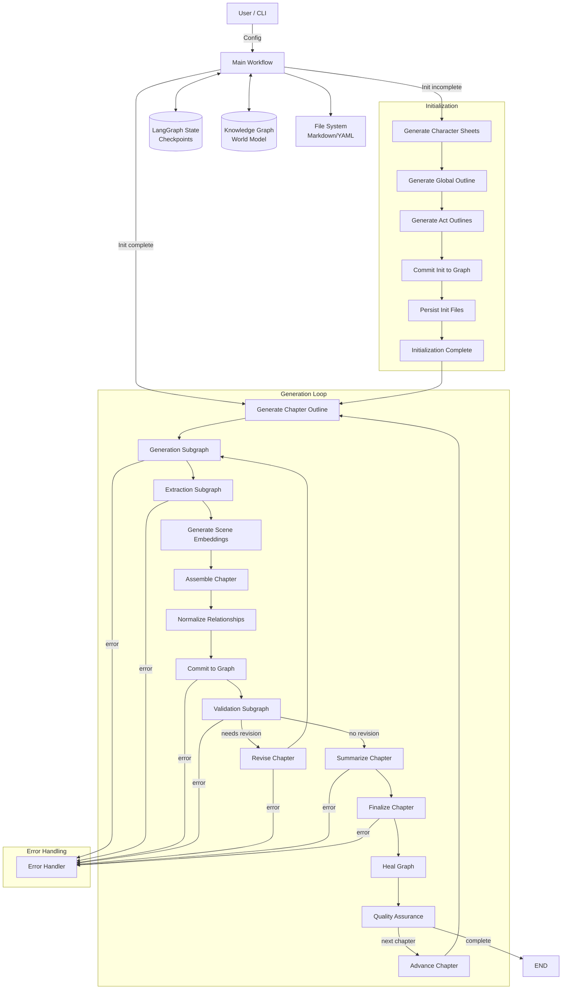

# SAGA Architecture: LangGraph & Neo4j Narrative Engine

## 1. Executive Summary

SAGA (Semantically And Graph‑enhanced Authoring) generates long‑form fiction using a **LangGraph** workflow orchestrator and a **Neo4j** knowledge graph for persistent world state. The system deliberately separates **orchestration** (control flow, error handling, revision loops) from **memory** (characters, locations, events, relationships) so that each chapter can be generated, validated, and persisted without being constrained by the LLM's context window. Recent refinements have introduced:

*   **Scene‑level generation** – a chapter is broken into a sequence of scenes, each generated with context retrieved from the graph.
*   **Scene-based extraction** – entities and relationships are extracted from each scene individually to improve accuracy and reduce prompt size, then consolidated.
*   **LLM‑based quality evaluation** – prose quality, coherence, pacing, and tone are scored, and low‑scoring chapters trigger revision.
*   **Extended contradiction detection** – timeline violations, world‑rule breaches, and abrupt relationship changes are now surfaced.
*   **Content externalization** – large text blobs (drafts, outlines, embeddings) are stored on disk via `ContentRef` to keep SQLite checkpoints lightweight.

The architecture remains fully local‑first, targeting a single user on a single machine.

---

## 2. High‑Level Architecture



The diagram illustrates the two main phases:

1.  **Initialization** – runs once per project to create character sheets, a global outline, and act outlines. The results are committed to Neo4j and persisted to disk.
2.  **Generation Loop** – repeats for each chapter. It creates a chapter outline, generates scenes, extracts entities/relationships from those scenes, generates embeddings, assembles the full chapter, normalizes relationships, commits to the graph, validates the result, optionally revises, summarizes, finalizes, and performs graph healing.

---

## 3. State Management (`NarrativeState`)

`NarrativeState` is a TypedDict defined in `core/langgraph/state.py`. It is the single source of truth passed between all LangGraph nodes and automatically persisted by the checkpoint saver. The schema is deliberately grouped into logical categories:

| Category | Fields (excerpt) | Purpose |
|---|---|---|
| **Metadata** | `project_id`, `title`, `genre`, `theme`, `setting`, `target_word_count` | Immutable project configuration. |
| **Progress** | `current_chapter`, `total_chapters`, `current_act` | Tracks where we are in the narrative. |
| **Content (externalized)** | `draft_ref`, `embedding_ref`, `scene_drafts_ref`, `scene_embeddings_ref`, `chapter_plan_ref`, `summaries_ref` | References to large text stored on disk via `ContentRef`. |
| **Extraction** | `extracted_entities_ref`, `extracted_relationships_ref` | References to structured data parsed from the scenes. |
| **Validation** | `contradictions`, `needs_revision`, `revision_guidance_ref` | Results of consistency checks and quality evaluation. |
| **Quality Metrics** | `coherence_score`, `prose_quality_score`, `plot_advancement_score`, `pacing_score`, `tone_consistency_score`, `quality_feedback` | Scores returned by the LLM quality evaluator. |
| **Model Configuration** | `generation_model`, `extraction_model`, `revision_model`, `large_model`, `medium_model`, `small_model`, `narrative_model` | Names of LLMs used at each stage. |
| **Workflow Control** | `current_node`, `iteration_count`, `max_iterations`, `force_continue` | Loop counters and override flags for revision cycles. |
| **Error Handling** | `last_error`, `has_fatal_error`, `error_node` | Information needed to abort gracefully. |
| **Filesystem Paths** | `project_dir` | Base directory for the project. |
| **Context Management** | `active_characters`, `key_events`, `hybrid_context_ref` | Handles dynamic context for generation. |
| **Chapter Planning** | `current_scene_index`, `chapter_plan_scene_count`, `chapter_plan_ref` | Scene‑level plan state. |
| **World Building** | `world_items`, `current_world_rules` | Persistent world facts and rule set. |
| **Protagonist** | `protagonist_name` | Primary character information. |
| **Initialization** | `character_sheets_ref`, `global_outline_ref`, `act_outlines_ref`, `chapter_outlines_ref`, `initialization_complete`, `initialization_step` | Tracks the one‑time setup workflow. |
| **Relationship Vocabulary** | `relationship_vocabulary`, `relationship_vocabulary_size`, `relationships_normalized_this_chapter` | Canonical relationship types and statistics. |
| **Graph Healing** | `provisional_count`, `last_healing_chapter`, `merge_candidates`, `pending_merges`, `auto_approved_merges`, `healing_history`, `nodes_graduated`, `nodes_merged`, `nodes_enriched`, `nodes_removed` | Metrics for post‑chapter graph maintenance. |

All fields are optional (`total=False`) but the `create_initial_state` factory populates sensible defaults for required data.

---

## 4. Content Externalization

Large textual artifacts (drafts, scene drafts, outlines, summaries, embeddings) are stored on disk using the `ContentManager` utility. The state contains only a `ContentRef` that points to the file location. This design keeps the SQLite checkpoint database small (typically a few kilobytes per checkpoint) and enables efficient diffing and versioning of generated content.

---

## 5. Subgraph Details

### 5.1 Generation Subgraph (`core/langgraph/subgraphs/generation.py`)

The generation subgraph builds a chapter **scene‑by‑scene**:

| Node | Description |
|---|---|
| `plan_scenes` | Uses the chapter outline to create a list of `SceneDetail` objects, each describing the goal of a scene. Stores the plan in `chapter_plan_ref`. |
| `retrieve_context` | Queries Neo4j for characters, relationships, recent events, and world‑rule facts relevant to the upcoming scene. |
| `draft_scene` | Calls the LLM to generate prose for a single scene using the retrieved context and the scene description. Appends the draft to `scene_drafts_ref`. |

The subgraph loops while `should_continue_scenes` returns `"continue"`. When all scenes are generated, the subgraph ends.

**Note:** The `assemble_chapter` node runs **after** the generation and extraction phases in the main workflow. It concatenates all scene drafts into the final chapter draft (`draft_ref`).

---

### 5.2 Extraction Subgraph (`core/langgraph/subgraphs/scene_extraction.py`)

Extraction runs **per-scene** to reduce prompt size and improve granularity, then consolidates the results.

1.  **`extract_from_scenes`**: Iterates through all generated scene drafts (`scene_drafts_ref`). For each scene, it performs 4 distinct LLM calls in parallel (logical grouping) to extract:
    *   **Characters**: Updates to status, traits, and descriptions.
    *   **Locations**: New locations or updates to existing ones.
    *   **Events**: Key plot events occurring in the scene.
    *   **Relationships**: New or evolving relationships between entities.
2.  **Consolidation**: After processing all scenes, the results are merged.
    *   Characters and World Items are deduplicated by name (keeping the most detailed description).
    *   Relationships are deduplicated by the `(source, target, type)` tuple.
3.  **Externalization**: The consolidated entities and relationships are saved to disk via `ContentManager`, and references (`extracted_entities_ref`, `extracted_relationships_ref`) are stored in the state.

---

### 5.3 Validation Subgraph (`core/langgraph/subgraphs/validation.py`)

The validation subgraph consists of three sequential checks:

1.  **`validate_consistency`** – Verifies that characters, relationships, and world constraints are respected in the Neo4j graph.
2.  **`evaluate_quality`** – An LLM‑based evaluator scores:
    *   Coherence
    *   Prose quality
    *   Plot advancement
    *   Pacing
    *   Tone consistency

    The evaluator returns a JSON payload; scores below a configurable threshold (default `0.7`) trigger a `quality_issue` contradiction and set `needs_revision`.
3.  **`detect_contradictions`** – Performs deeper narrative analysis:
    *   **Relationship evolution problems** – Flags abrupt changes (e.g., `HATES → LOVES`) without sufficient narrative development.
    *   (Future expansion: Timeline violations, location inconsistencies).

The subgraph returns `END` after `detect_contradictions`. The main workflow interprets `needs_revision` together with `iteration_count` and `max_iterations` to decide whether to loop back for a revision.

---

### 5.4 Healing Subgraph (`core/langgraph/nodes/graph_healing_node.py`)

After a chapter is finalized, `heal_graph` runs maintenance on the knowledge graph:

*   **Enrichment** – Uses the LLM to fill missing attributes of provisional nodes.
*   **Merging** – Automatically merges entities that have high name‑similarity and identical relationship patterns.
*   **Garbage collection** – Removes orphaned nodes and updates statistics.

Healing updates the `graph_healing` metrics in `NarrativeState` for observability.

---

### 5.5 Quality Assurance & Advancement

After graph healing, the workflow performs final quality checks and either moves to the next chapter or terminates.

| Node | Description |
|---|---|
| `check_quality` | Performs a high-level assessment of the finalized chapter, checking for tone consistency and overall narrative quality. |
| `advance_chapter` | Increments `current_chapter`, resets per-chapter flags (like `iteration_count` and `needs_revision`), and clears chapter-specific content references to prepare for the next loop. |

The transition from `check_quality` is determined by `should_continue_to_next_chapter`, which checks if `current_chapter < total_chapters`.

---

## 6. Error Handling Strategy

Every major node is wrapped by the conditional edge `should_handle_error`. If `state["has_fatal_error"]` is true, control transfers to the `error_handler` node, which logs the failure, marks `workflow_failed`, and then terminates the graph (`END`). This approach ensures graceful shutdown and preserves the last good checkpoint for later debugging.

---

## 7. Data & Persistence

### 7.1 Neo4j Schema

The knowledge graph uses a **labeled property graph** with the following node and relationship types.

#### Canonical domain node labels (schema contract)
SAGA enforces a canonical set of **9** domain labels:

- `Character`
- `Location`
- `Event`
- `Item`
- `Organization`
- `Concept`
- `Trait`
- `Chapter`
- `Novel`

These labels are treated as a strict schema surface (indexes/constraints + Cypher label interpolation safety).

#### Subtypes and legacy aliases
Subtypes (e.g., `Faction`, `Settlement`, `Artifact`) are represented using properties (typically `category`) on nodes whose label is one of the canonical labels above.

#### Relationships
Relationship types are expected to be uppercase with underscores (e.g., `LOCATED_IN`, `MEMBER_OF`, `BETRAYS`). All write operations go through the `commit_to_graph` node, which performs a two‑phase deduplication (name‑based followed by relationship‑pattern‑based) to avoid graph pollution.

### 7.2 File‑System Layout (under `output/`)

```
output/
├── .saga/
│   ├── checkpoints.db          # LangGraph SQLite checkpoints
│   ├── logs/                   # Runtime logs per chapter
│   └── content/                # Externalized content (blobs)
│       ├── drafts/
│       ├── outlines/
│       ├── summaries/
│       ├── extractions/
│       └── embeddings/
├── chapters/
│   └── chapter_01.md           # Finalized prose for each chapter
├── summaries/
│   └── chapter_01_summary.txt
├── outline/
│   ├── structure.yaml          # Global act/plot structure
│   └── beats.yaml              # Detailed outline per act/chapter
├── characters/
│   └── protagonist.yaml        # Character profiles (YAML)
├── world/
│   └── items.yaml              # Locations, objects, world rules
└── exports/
    └── novel_full.md           # Compiled manuscript
```

---

## 8. Future Directions

### Planned Enhancements
*   **Interactive Revision Mode** – allow a human to edit a chapter during the `revise` phase.
*   **Vector‑Only Mode** – skip Neo4j and rely solely on embedding‑based retrieval for lightweight setups.
*   **Fine‑grained Model Tiering** – automatically select model size based on node complexity.
*   **Persisted Revision History** – store patches and evaluation results for auditability.

---

## 9. Project Constraints (Reminder)

*   Single‑user, single‑machine deployment.
*   No external web services or micro‑service architecture.
*   All persistence is local: Neo4j (embedded or Docker) and the local filesystem.
*   Designed for consumer‑grade hardware; no distributed scaling assumptions.
