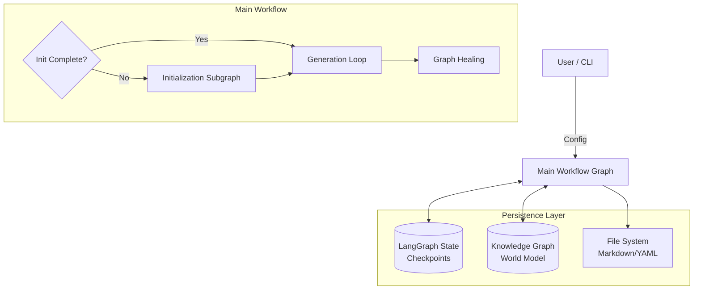
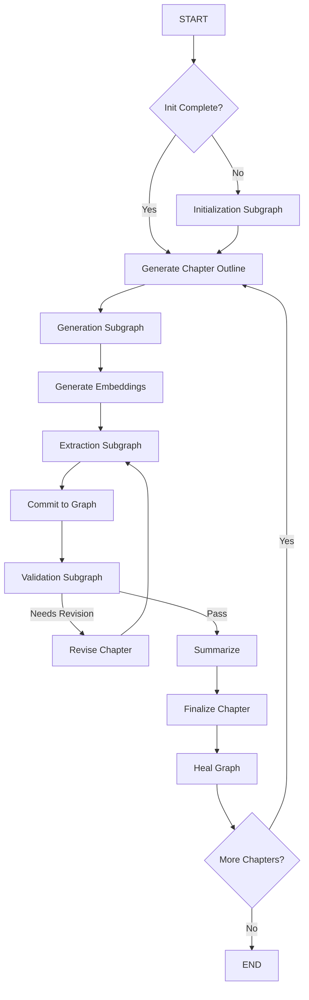

# SAGA Architecture: LangGraph & Neo4j Narrative Engine

> **Semantically And Graph-enhanced Authoring (SAGA)**
>
> A hybrid architecture combining **LangGraph** workflow orchestration with **Neo4j** knowledge graph persistence for coherent, long-form narrative generation.

---

## 1. Executive Summary

SAGA addresses the core challenges of long-form AI narrative generation—context window limits, entity consistency, and narrative arc management—by decoupling **orchestration** from **memory**.

*   **Orchestration (LangGraph)**: Manages the recursive control flow of writing a novel (Act → Chapter → Scene). It handles state persistence, error recovery, and complex branching logic (e.g., revision loops).
*   **Memory (Neo4j)**: Stores the "world state" (characters, locations, events, relationships) as a graph, allowing the system to query relevant context for every scene rather than relying on massive context windows.
*   **Execution (Async Python)**: Parallelizes heavy tasks like entity extraction to ensure performance.

---

## 2. High-Level Architecture

The system operates as a hierarchical graph workflow. The **Main Workflow** acts as the conductor, routing control between specialized **Subgraphs** for distinct phases of the writing process.



---

## 3. State Management (`NarrativeState`)

The `NarrativeState` (defined in `core/langgraph/state.py`) is the central data structure passed between nodes. It is automatically persisted to SQLite after every node execution, enabling "time-travel" debugging and crash recovery.

### 3.1 Core State Schema

| Field Category | Key Fields | Description |
| :--- | :--- | :--- |
| **Metadata** | `project_id`, `genre`, `theme` | Immutable project settings. |
| **Progress** | `current_chapter`, `current_act` | Cursor tracking narrative position. |
| **Planning** | `global_outline`, `act_outlines`, `chapter_outlines` | Hierarchical structure generated during init. |
| **Context** | `active_characters`, `previous_chapter_summaries` | Dynamic context retrieved from Neo4j for the current chapter. |
| **Drafting** | `draft_text`, `scene_drafts` | The prose currently being generated or revised. |
| **Extraction** | `extracted_entities`, `extracted_relationships` | Structured data parsed from the draft, pending commit. |
| **Validation** | `contradictions`, `needs_revision`, `quality_scores` | Feedback from validation nodes triggering revision loops. |
| **Healing** | `healing_history`, `provisional_count` | Metrics for graph maintenance and entity merging. |
| **Control** | `iteration_count`, `has_fatal_error` | Loop guards and error flags. |

---

## 4. Workflow Topology

### 4.1 Main Workflow (`core/langgraph/workflow.py`)

The entry point (`create_full_workflow_graph`) determines if the project needs initialization or can jump straight to chapter generation.



### 4.2 Initialization Subgraph
**Goal**: Create the "World Bible" before writing prose.
1.  **`init_character_sheets`**: Generates 3-5 protagonists with rich traits/motivations.
2.  **`init_global_outline`**: Creates high-level 3-5 act structure.
3.  **`init_act_outlines`**: Expands acts into chapter beats.
4.  **`init_commit_to_graph`**: Persists initial entities to Neo4j.

### 4.3 Generation Subgraph (`core/langgraph/subgraphs/generation.py`)
**Goal**: Write a coherent chapter scene-by-scene.
*   **`plan_scenes`**: Breaks the chapter outline into discrete scene beats.
*   **`retrieve_context`**: Queries Neo4j for characters/locations relevant *specifically to the current scene*.
*   **`draft_scene`**: Generates prose for the scene using hybrid context.
*   **`assemble_chapter`**: Concatenates scene drafts into `state["draft_text"]`.

### 4.4 Extraction Subgraph (`core/langgraph/subgraphs/extraction.py`)
**Goal**: Convert unstructured prose into structured graph updates.
*   Uses **parallel execution** (LangGraph `asyncio.gather` pattern) to run specialized extractors simultaneously:
    *   `extract_characters`
    *   `extract_locations`
    *   `extract_events`
    *   `extract_relationships`
*   **`consolidate`**: Merges results into `state["extracted_entities"]`.

### 4.5 Validation Subgraph (`core/langgraph/subgraphs/validation.py`)
**Goal**: Ensure quality and consistency.
1.  **`validate_consistency`**: Checks for hard contradictions (e.g., dead character speaking).
2.  **`evaluate_quality`**: Scores prose, pacing, and coherence (0.0-1.0).
3.  **`detect_contradictions`**: Checks timeline ordering and world rule violations.

---

## 5. Key Node Implementations

### 5.1 `commit_to_graph` (Two-Phase Deduplication Logic)
This node acts as the gatekeeper to Neo4j. It prevents database pollution using a two-phase deduplication strategy:

**Phase 1: Name-Based Deduplication (BEFORE Relationships)**
1.  **Fuzzy Matching**: Comparing extracted names (e.g., "Jon") against existing DB nodes ("Jonathan") using Levenshtein distance.
2.  **ID Resolution**: Mapping extracted entities to persistent Neo4j IDs.
3.  **Fast Merging**: Catches obvious duplicates with high name similarity (threshold: 0.8+).

**Phase 2: Relationship-Based Deduplication (AFTER Relationships)**
1.  **Relationship Pattern Analysis**: After relationships are committed, identifies entities with similar names (0.6-0.8 similarity) that have identical relationship patterns.
2.  **Jaccard Similarity**: Compares relationship types and targets to calculate pattern overlap.
3.  **Context-Aware Merging**: Merges entities that are clearly the same based on relationship context.

**Why Two Phases?**
Deduplication needs relationship context, but relationships can't be extracted until entities exist. The two-phase approach solves this ordering problem:
- Phase 1 catches obvious duplicates quickly
- Phase 2 catches borderline cases that need relationship context

**Example**: "Alice" vs "Alice Chen" might have borderline name similarity (0.75), but if both have identical relationships with "Bob" and "Central Lab", they're clearly the same person and will be merged in Phase 2.

**Configuration**:
- `ENABLE_PHASE2_DEDUPLICATION`: Enable/disable Phase 2 (default: True)
- `PHASE2_NAME_SIMILARITY_THRESHOLD`: Name similarity threshold for Phase 2 candidates (default: 0.6)
- `PHASE2_RELATIONSHIP_SIMILARITY_THRESHOLD`: Relationship pattern similarity for merging (default: 0.7)

**Atomic Transactions**: All node/relationship creations execute in a single batch to ensure graph integrity.

### 5.2 `revise_chapter` (The Loop)
If validation fails, this node:
1.  Constructs a **Revision Prompt** containing the draft + specific contradictions found.
2.  Uses a "reasoning" or higher-quality model (configurable) to rewrite the text.
3.  Increments `iteration_count`. If `max_iterations` (default 3) is reached, it forces flow to proceed to prevent infinite loops.

### 5.3 `heal_graph` (Entity Maintenance)
Runs *after* a chapter is finalized. It performs "garbage collection" and enrichment:
*   **Enrichment**: Finds "provisional" nodes (sparse data) and asks an LLM to fill in missing details based on cumulative text.
*   **Merging**: Identifies nodes that likely represent the same entity (e.g., "The Old Tower" and "The Ancient Spire") and merges them.

---

## 6. Data & Persistence

### 6.1 Neo4j Schema
The Knowledge Graph uses a labeled property graph structure:

*   **Nodes**: `Character`, `Location`, `Event`, `Object`, `Chapter`, `WorldRule`
*   **Relationships**:
    *   `KNOWS`, `LOVES`, `ENEMIES_WITH` (Social)
    *   `LOCATED_IN`, `VISITED` (Spatial)
    *   `PARTICIPATED_IN`, `WITNESSED` (Event)
    *   `OCCURRED_IN`, `MENTIONED_IN` (Meta)

### 6.2 File System Output
While the *state* is in SQLite/Neo4j, the *product* is on disk:
```text
project_root/
├── .saga/
│   ├── checkpoints.db   # LangGraph State
│   └── logs/
├── chapters/
│   ├── chapter_01.md    # Finalized prose
│   └── ...
├── summaries/           # Text summaries for context
└── outline/             # YAML outlines
```

---

## 7. Error Handling

The architecture implements a "Fail-Gracefully" strategy:

1.  **`should_handle_error`**: A conditional edge present after every major step. Checks `state["has_fatal_error"]`.
2.  **Error Recovery**:
    *   **LLM Failures**: Retried with backoff.
    *   **Parsing Failures**: Fallback to regex or "skip extraction" (preserving prose).
    *   **Graph Errors**: Logged, but workflow attempts to save text to disk before exiting.
3.  **`force_continue`**: A user override flag that allows bypassing validation checks to move a "stuck" workflow forward.

---

## 8. Migration & Future

This architecture replaces the legacy "NANA" orchestrator.

**Current Capabilities**:
*   Phased linear novel generation.
*   Automatic context maintenance.
*   Self-correction loops.

**Future Enhancements**:
*   **Interactive Mode**: Human-in-the-loop editing during the `revise` phase.
*   **Vector-Only Mode**: A lightweight mode disabling Neo4j for purely vector-based RAG.