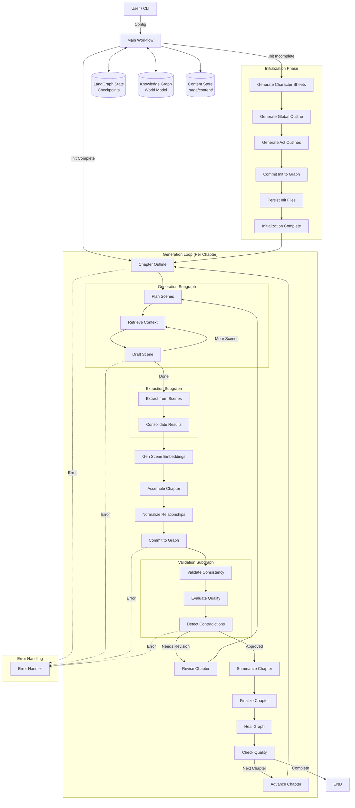

# SAGA Architecture: LangGraph & Neo4j Narrative Engine

## 1. Executive Summary

SAGA (Semantic And Graph-enhanced Authoring) generates long-form fiction using a **LangGraph** workflow orchestrator and a **Neo4j** knowledge graph for persistent world state. The system deliberately separates **orchestration** (control flow, error handling, revision loops) from **memory** (characters, locations, events, relationships). This ensures each chapter is generated, validated, and persisted without being constrained by the LLM's context window.

Key architectural features include:

*   **Scene-Level Generation**: Chapters are planned and generated scene-by-scene, retrieving focused context for each scene.
*   **Scene-Based Extraction**: Entities and relationships are extracted per scene to improve accuracy and consolidated before graph commitment.
*   **Content Externalization**: Large text artifacts (drafts, outlines, embeddings) are stored on disk (`.saga/content/`) and referenced in the state via `ContentRef`, keeping SQLite checkpoints lightweight (~1KB).
*   **Comprehensive Validation**: A multi-stage validation subgraph checks for graph consistency, evaluates prose quality (LLM-based scoring), and detects narrative contradictions (e.g., abrupt relationship shifts).
*   **Graph Healing & QA**: Automated post-chapter maintenance merges duplicate entities, enriches provisional nodes, and performs periodic quality assurance checks.
*   **Robust Error Handling**: A formalized error handling strategy routes fatal errors to a dedicated handler, ensuring graceful shutdown and state preservation.

The architecture remains fully **local-first**, targeting a single user on a single machine with no external cloud dependencies.

---

## 2. Project Bootstrapping

Before the main LangGraph workflow begins, a **bootstrapping phase** initializes the project structure and configuration.

*   **`ProjectBootstrapper`**: Converts a high-level user prompt (e.g., "A cyberpunk detective story") into a structured JSON configuration.
*   **`NarrativeProjectConfig`**: A Pydantic schema defining the project's genre, theme, setting, and protagonist.
*   **`ProjectManager`**: Handles lifecycle management, including directory creation, configuration persistence, and project promotion.

This separation ensures the LangGraph orchestrator always starts with a valid, schema-compliant project context.

---

## 3. High-Level Architecture

The system uses a hierarchical graph structure with a main orchestrator and specialized subgraphs for complex tasks.



### Workflow Phases

1.  **Initialization**: Runs once per project. Generates character sheets, global/act outlines, and persists the initial canon to Neo4j.
2.  **Generation Loop**: Repeats for each chapter:
    *   **Planning**: Creates a scene-by-scene outline.
    *   **Generation**: Drafts scenes iteratively using retrieved graph context.
    *   **Extraction**: Extracts entities/relationships per scene and consolidates them.
    *   **Assembly**: Concatenates scene drafts into a full chapter.
    *   **Commit**: Normalizes relationships and updates the Knowledge Graph.
    *   **Validation**: Checks consistency, evaluates quality, and detects contradictions.
    *   **Finalization**: Summarizes the chapter, updates files, runs graph healing and QA.

---

## 4. State Management (`NarrativeState`)

`NarrativeState` is a `TypedDict` defined in `core/langgraph/state.py`. It serves as the single source of truth, passed between nodes and persisted by the SQLite checkpointer.

### Key State Categories

| Category | Fields (excerpt) | Purpose |
|---|---|---|
| **Metadata** | `project_id`, `title`, `genre`, `target_word_count` | Immutable project configuration. |
| **Progress** | `current_chapter`, `total_chapters`, `run_start_chapter` | Tracks narrative progress. |
| **Content References** | `draft_ref`, `scene_drafts_ref`, `chapter_plan_ref`, `extracted_entities_ref` | **ContentRef** pointers to externalized files. State does *not* hold large text blobs. |
| **Validation** | `contradictions`, `needs_revision`, `revision_guidance_ref` | validation results and revision flags. |
| **Quality Metrics** | `coherence_score`, `prose_quality_score`, `pacing_score` | LLM-generated quality scores (0.0 - 1.0). |
| **Healing & QA** | `provisional_count`, `nodes_merged`, `qa_results`, `total_qa_issues` | Metrics from graph maintenance nodes. |
| **Control Flow** | `current_node`, `iteration_count`, `force_continue`, `has_fatal_error` | Workflow routing and error flags. |

### Content Externalization Strategy

To avoid SQLite size limits and improve performance, large artifacts are stored on disk using `ContentManager`. The state only holds a `ContentRef`:

```python
class ContentRef(TypedDict):
    path: str          # Relative path (e.g., ".saga/content/drafts/ch1_v1.txt")
    content_type: str  # e.g., "draft", "outline"
    version: int       # Revision version
    size_bytes: int    # For integrity checks
    checksum: str      # SHA-256 hash
```

This ensures checkpoints remain small (~1-5KB) even as the novel grows.

---

## 5. Subgraph Details

### 5.1 Generation Subgraph (`core/langgraph/subgraphs/generation.py`)

Generates the chapter content scene-by-scene.

| Node | Function |
|---|---|
| `plan_scenes` | Decomposes the chapter outline into a list of `SceneDetail` objects. |
| `retrieve_context` | Queries Neo4j for characters, locations, and events relevant to the specific scene. |
| `draft_scene` | Generates prose for one scene using the retrieved context. |

*   **Loop**: The subgraph iterates `retrieve_context` → `draft_scene` until all planned scenes are complete.
*   **Output**: A list of scene drafts stored in `scene_drafts_ref`.

### 5.2 Extraction Subgraph (`core/langgraph/subgraphs/scene_extraction.py`)

Extracts structured data from the generated text.

| Node | Function |
|---|---|
| `extract_from_scenes` | Processes each scene draft individually to extract entities (Characters, Locations, Events) and Relationships. |
| `consolidate` | Merges extraction results, deduplicating entities by name and relationships by `(source, target, type)`. |

*   **Benefit**: Scene-level extraction reduces context window pressure on the LLM, resulting in higher accuracy than full-chapter extraction.

### 5.3 Validation Subgraph (`core/langgraph/subgraphs/validation.py`)

Ensures narrative quality and consistency.

| Node | Function |
|---|---|
| `validate_consistency` | Checks graph constraints (e.g., valid relationship types) and trait consistency. |
| `evaluate_quality` | Uses an LLM to score the chapter on Coherence, Prose, Pacing, etc. Low scores trigger `needs_revision`. |
| `detect_contradictions` | Checks for abrupt relationship shifts (e.g., `HATES` → `LOVES` without development) and severe logic errors. |

*   **Routing**: If `needs_revision` is true and `iteration_count < max_iterations`, the main workflow loops back to `revise`.

---

## 6. Graph Maintenance & QA

### 6.1 Graph Healing (`core/langgraph/nodes/graph_healing_node.py`)

Runs after every chapter to maintain graph hygiene.
*   **Enrichment**: Fills in missing details for provisional nodes.
*   **Merging**: Identifies and merges duplicate entities (e.g., "Bob" and "Bob Smith").
*   **Observability**: Tracks metrics like `nodes_graduated` (provisional → confirmed) and `nodes_merged`.

### 6.2 Quality Assurance (`core/langgraph/nodes/quality_assurance_node.py`)

Runs periodically (configurable frequency) to perform deeper checks.
*   **Contradictory Traits**: Finds characters with conflicting traits (e.g., "Brave" AND "Cowardly").
*   **Post-Mortem Activity**: Detects events involving characters marked as "Dead".
*   **Deduplication**: cleans up redundant relationships.

---

## 7. Error Handling & Persistence

### 7.1 Error Handling Strategy
*   **Fatal Errors**: Nodes catch unrecoverable errors and set `has_fatal_error: True` in state.
*   **Routing**: The workflow checks `should_handle_error` after key steps.
*   **Handler**: The `error_handler` node logs the failure and gracefully terminates the workflow, preserving the last valid checkpoint for debugging.

### 7.2 Persistence
*   **State**: LangGraph state is persisted to `output/.saga/checkpoints.db` (SQLite).
*   **Graph**: Knowledge Graph data resides in Neo4j (local/Docker).
*   **Content**: Large artifacts are stored in `output/.saga/content/`.
*   **Exports**: Human-readable Markdown and YAML files are written to `output/chapters/`, `output/characters/`, etc.

---

## 8. Data Model

### Neo4j Schema (Canonical Labels)
*   `Character`
*   `Location`
*   `Event`
*   `Item`
*   `Trait`
*   `Chapter`

**Infrastructure Nodes**: `NovelInfo`, `WorldContainer`, `ValueNode`.

### File System Layout
```text
output/
├── .saga/
│   ├── checkpoints.db          # Workflow state
│   └── content/                # Externalized artifacts (binary/json/txt)
│       ├── drafts/
│       ├── scene_drafts/
│       ├── embeddings/
│       └── ...
├── chapters/                   # Final Markdown chapters
├── characters/                 # Character profiles (YAML)
├── world/                      # World building info
├── outline/                    # Structure and beats
└── exports/                    # Compiled manuscript
```
