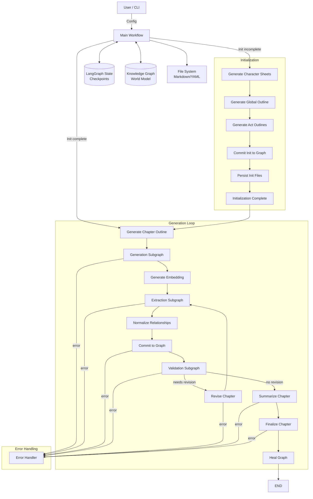

# SAGA Architecture: LangGraph & Neo4j Narrative Engine

## 1. Executive Summary

SAGA (Semantically And Graph‑enhanced Authoring) generates long‑form fiction using a **LangGraph** workflow orchestrator and a **Neo4j** knowledge graph for persistent world state.  The system deliberately separates **orchestration** (control flow, error handling, revision loops) from **memory** (characters, locations, events, relationships) so that each chapter can be generated, validated, and persisted without being constrained by the LLM’s context window.  Recent refinements have introduced:

* **Scene‑level generation** – a chapter is broken into a sequence of scenes, each generated with context retrieved from the graph.
* **Sequential extraction** – characters, locations, events, and relationships are extracted one after another to avoid reducer‑based state accumulation.
* **LLM‑based quality evaluation** – prose quality, coherence, pacing, and tone are scored, and low‑scoring chapters trigger revision.
* **Extended contradiction detection** – timeline violations, world‑rule breaches, and abrupt relationship changes are now surfaced.
* **Content externalization** – large text blobs are stored on disk via `ContentRef` to keep SQLite checkpoints lightweight.

The architecture remains fully local‑first, targeting a single user on a single machine.

---

## 2. High‑Level Architecture



The diagram illustrates the two main phases:

1. **Initialization** – runs once per project to create character sheets, a global outline, and act outlines. The results are committed to Neo4j and persisted to disk.
2. **Generation Loop** – repeats for each chapter.  It creates a chapter outline (on‑demand), generates the chapter scene‑by‑scene, extracts structured entities, normalizes relationships, commits to the graph, validates the result, optionally revises, summarizes, finalizes, and performs graph healing.

---

## 3. State Management (`NarrativeState`)

`NarrativeState` is a TypedDict defined in `core/langgraph/state.py`.  It is the single source of truth passed between all LangGraph nodes and automatically persisted by the checkpoint saver.  The schema is deliberately grouped into logical categories:

| Category | Fields (excerpt) | Purpose |
|---|---|---|
| **Metadata** | `project_id`, `title`, `genre`, `theme`, `setting`, `target_word_count` | Immutable project configuration. |
| **Progress** | `current_chapter`, `total_chapters`, `current_act` | Tracks where we are in the narrative. |
| **Content (externalized)** | `draft_ref`, `embedding_ref`, `scene_drafts_ref`, `chapter_plan_ref`, `summaries_ref` | References to large text stored on disk via `ContentRef`. |
| **Extraction** | `extracted_entities`, `extracted_relationships`, `extracted_entities_ref`, `extracted_relationships_ref` | Structured data parsed from the draft. |
| **Validation** | `contradictions`, `needs_revision`, `revision_feedback`, `is_from_flawed_draft` | Results of consistency checks and quality evaluation. |
| **Quality Metrics** | `coherence_score`, `prose_quality_score`, `plot_advancement_score`, `pacing_score`, `tone_consistency_score`, `quality_feedback` | Scores returned by the LLM quality evaluator. |
| **Model Configuration** | `generation_model`, `extraction_model`, `revision_model`, `large_model`, `medium_model`, `small_model`, `narrative_model` | Names of LLMs used at each stage. |
| **Workflow Control** | `current_node`, `iteration_count`, `max_iterations`, `force_continue` | Loop counters and override flags for revision cycles. |
| **Error Handling** | `last_error`, `has_fatal_error`, `workflow_failed`, `failure_reason`, `error_node`, `retry_count` | Information needed to abort gracefully. |
| **Filesystem Paths** | `project_dir`, `chapters_dir`, `summaries_dir` | Base directories for generated artifacts. |
| **Context Management** | `context_epoch`, `hybrid_context_ref`, `kg_facts_ref` | Handles dynamic context for generation. |
| **Chapter Planning** | `chapter_plan`, `plot_point_focus`, `current_scene_index`, `chapter_plan_ref` | Scene‑level plan produced by `plan_scenes`. |
| **Revision State** | `evaluation_result`, `patch_instructions` | Stores evaluation and patch data when a revision is performed. |
| **World Building** | `world_items`, `current_world_rules` | Persistent world facts and rule set. |
| **Protagonist** | `protagonist_name`, `protagonist_profile` | Primary character information. |
| **Initialization** | `character_sheets_ref`, `global_outline_ref`, `act_outlines_ref`, `chapter_outlines_ref`, `character_sheets`, `global_outline`, `act_outlines`, `world_history`, `initialization_complete`, `initialization_step` | Tracks the one‑time setup workflow. |
| **Relationship Vocabulary** | `relationship_vocabulary`, `relationship_vocabulary_size`, `relationships_normalized_this_chapter`, `relationships_novel_this_chapter` | Canonical relationship types and statistics. |
| **Graph Healing** | `provisional_count`, `last_healing_chapter`, `merge_candidates`, `pending_merges`, `auto_approved_merges`, `healing_history`, `nodes_graduated`, `nodes_merged`, `nodes_enriched`, `nodes_removed` | Metrics for post‑chapter graph maintenance. |

All fields are optional (`total=False`) but the `create_initial_state` factory populates sensible defaults for required data.

---

## 4. Content Externalization

Large textual artifacts (drafts, scene drafts, outlines, summaries, embeddings) are stored on disk using the `ContentManager` utility.  The state contains only a `ContentRef` that points to the file location.  This design keeps the SQLite checkpoint database small (typically a few kilobytes per checkpoint) and enables efficient diffing and versioning of generated content.

---

## 5. Subgraph Details

### 5.1 Generation Subgraph (`core/langgraph/subgraphs/generation.py`)

The generation subgraph builds a chapter **scene‑by‑scene**:

| Node | Description |
|---|---|
| `plan_scenes` | Uses the chapter outline to create a list of `SceneDetail` objects, each describing the goal of a scene. |
| `retrieve_context` | Queries Neo4j for characters, relationships, recent events, and world‑rule facts relevant to the upcoming scene. |
| `draft_scene` | Calls the LLM to generate prose for a single scene using the retrieved context and the scene description. |
| `assemble_chapter` | Concatenates all scene drafts (or the externalized `scene_drafts_ref`) into the final chapter draft and stores a reference via `draft_ref`. |

The subgraph loops while `should_continue_scenes` returns `"continue"`.  When all scenes are generated, control passes to `assemble_chapter` and then to `END`.

---

### 5.2 Extraction Subgraph (`core/langgraph/subgraphs/extraction.py`)

Extraction runs **sequentially** to avoid reducer‑based state accumulation that previously caused cross‑chapter leakage:

1. `extract_characters` – clears any prior character extraction and populates `extracted_entities["characters"]`.
2. `extract_locations` – appends location entities to `world_items`.
3. `extract_events` – appends event entities to `world_items`.
4. `extract_relationships` – extracts relationship triples.
5. `consolidate_extraction` – logs completion and optionally externalizes the results.

Because each node returns a **new** state dictionary, the workflow safely replaces the previous extraction results.

---

### 5.3 Validation Subgraph (`core/langgraph/subgraphs/validation.py`)

The validation subgraph consists of three sequential checks:

1. **`validate_consistency`** – wraps the original graph‑consistency node.  It verifies that characters, relationships, and world constraints are respected in the Neo4j graph.
2. **`evaluate_quality`** – a new LLM‑based evaluator that scores:
   * Coherence
   * Prose quality
   * Plot advancement
   * Pacing
   * Tone consistency

   The evaluator returns a JSON payload; scores below a configurable threshold (`0.5` by default) are turned into a `Contradiction` of type `"quality_issue"` and cause `needs_revision` to be set.
3. **`detect_contradictions`** – performs deeper narrative analysis:
   * **Timeline violations** – checks extracted events against historical events stored in Neo4j.
   * **World‑rule breaches** – uses the LLM to verify that the draft does not break any rule defined in `world_rules` or stored as `WorldRule` nodes.
   * **Character location inconsistencies** – ensures a character is not inexplicably in two places at once.
   * **Relationship evolution problems** – flags abrupt changes such as `HATES → LOVES` without sufficient development.

The subgraph returns `END` after `detect_contradictions`.  The main workflow interprets `needs_revision` together with `iteration_count` and `max_iterations` to decide whether to loop back to the extraction subgraph for a revision.

---

### 5.4 Healing Subgraph (`core/langgraph/nodes/graph_healing_node.py`)

After a chapter is finalized, `heal_graph` runs maintenance on the knowledge graph:

* **Enrichment** – uses the LLM to fill missing attributes of provisional nodes.
* **Merging** – automatically merges entities that have high name‑similarity and identical relationship patterns.
* **Garbage collection** – removes orphaned nodes and updates statistics.

Healing updates the `graph_healing` metrics in `NarrativeState` for observability.

---

## 6. Error Handling Strategy

Every major node is wrapped by the conditional edge `should_handle_error`.  If `state["has_fatal_error"]` is true, control transfers to the `error_handler` node, which logs the failure, marks `workflow_failed` and `failure_reason`, and then terminates the graph (`END`).  This approach ensures graceful shutdown and preserves the last good checkpoint for later debugging.

---

## 7. Data & Persistence

### 7.1 Neo4j Schema

The knowledge graph uses a **labeled property graph** with the following node and relationship types:

* **Nodes** – `Character`, `Location`, `Event`, `Object`, `Chapter`, `WorldRule`.
* **Relationships** –
  * Social: `KNOWS`, `LOVES`, `ENEMIES_WITH`, `TRUSTS`, `WORKS_FOR`, `ALLIES_WITH`.
  * Spatial: `LOCATED_IN`, `VISITED`.
  * Event‑related: `PARTICIPATED_IN`, `WITNESSED`, `CAUSED`.
  * Meta: `OCCURRED_IN`, `MENTIONED_IN`.
  * Embedding index: `chapterEmbeddings` on `Chapter` for semantic search.

All write operations go through the `commit_to_graph` node, which performs a two‑phase deduplication (name‑based followed by relationship‑pattern‑based) to avoid graph pollution.

### 7.2 File‑System Layout (under `output/`)

```
output/
├── .saga/
│   ├── checkpoints.db          # LangGraph SQLite checkpoints
│   └── logs/                  # Runtime logs per chapter
├── chapters/
│   └── chapter_01.md          # Finalized prose for each chapter
├── summaries/
│   └── chapter_01_summary.txt
├── outline/
│   ├── structure.yaml         # Global act/plot structure
│   └── beats.yaml             # Detailed outline per act/chapter
├── characters/
│   └── protagonist.yaml       # Character profiles (YAML)
├── world/
│   └── items.yaml             # Locations, objects, world rules
└── exports/
    └── novel_full.md          # Compiled manuscript
```

Large textual artifacts (drafts, scene drafts, embeddings) are stored under `.saga/content/` and referenced via `ContentRef`.

---

## 8. Migration & Future Directions

### Recent Changes
* Replaced reducer‑based extraction with a **sequential** pipeline.
* Added **LLM quality evaluation** (`evaluate_quality`).
* Expanded **contradiction detection** to include timeline, world‑rule, and relationship‑evolution checks.
* Introduced **scene planning** and per‑scene generation loop.
* Externalized all large content to keep checkpoints lightweight.
* Updated the main workflow to use the new `should_handle_error` guard everywhere.

### Planned Enhancements
* **Interactive Revision Mode** – allow a human to edit a chapter during the `revise` phase.
* **Vector‑Only Mode** – skip Neo4j and rely solely on embedding‑based retrieval for lightweight setups.
* **Fine‑grained Model Tiering** – automatically select model size based on node complexity.
* **Persisted Revision History** – store patches and evaluation results for auditability.

---

## 9. Project Constraints (Reminder)

* Single‑user, single‑machine deployment.
* No external web services or micro‑service architecture.
* All persistence is local: Neo4j (embedded or Docker) and the local filesystem.
* Designed for consumer‑grade hardware; no distributed scaling assumptions.

---

*Generated by Claude Code – updated to reflect the current SAGA codebase as of 2025‑12‑08.*