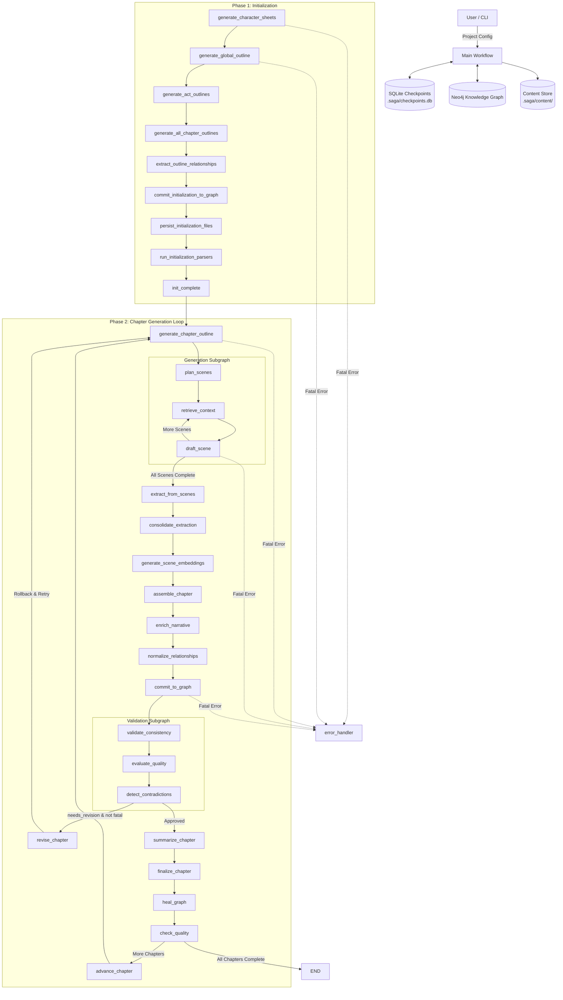

# SAGA Architecture: LangGraph Workflow Orchestration

## 1. Executive Summary

SAGA (Semantic And Graph-enhanced Authoring) is a local-first Python CLI application for AI-driven long-form fiction generation. It uses **LangGraph** for workflow orchestration and **Neo4j** as a knowledge graph for persistent world state management.

**Core Design Principles:**

*   **Local-First**: Single user, single machine. No web servers, APIs, or cloud dependencies
*   **Scene-Level Generation**: Chapters are decomposed into scenes, each drafted with focused context retrieval
*   **Content Externalization**: Large text artifacts stored on disk via `ContentManager`, referenced in state via `FrozenContentRef`
*   **Atomic Persistence**: All Neo4j writes for a chapter execute in a single transaction
*   **Validation-Driven Revision**: Multi-stage validation triggers revision loops when quality falls below thresholds
*   **Graceful Degradation**: Non-critical operations (healing, QA, embeddings) fail gracefully without blocking workflow

---

## 2. System Architecture Overview

### 2.1 High-Level Workflow



### 2.2 Workflow Phases

**Phase 1: Initialization** (runs once per project)

1. `generate_character_sheets` - Create structured character profiles
2. `generate_global_outline` - High-level story structure
3. `generate_act_outlines` - Act-level narrative arcs
4. `generate_all_chapter_outlines` - All chapter outlines
5. `extract_outline_relationships` - Extract relationships from outlines
6. `commit_initialization_to_graph` - Persist to Neo4j
7. `persist_initialization_files` - Save to filesystem
8. `run_initialization_parsers` - Parse and validate artifacts

**Phase 2: Chapter Generation** (repeats per chapter)

1. **Planning**: `generate_chapter_outline` → `plan_scenes`
2. **Generation**: `retrieve_context` → `draft_scene` (scene loop)
3. **Extraction**: `extract_from_scenes` → `consolidate_extraction`
4. **Processing**: `generate_scene_embeddings` → `assemble_chapter` → `enrich_narrative` → `normalize_relationships`
5. **Persistence**: `commit_to_graph` (atomic transaction)
6. **Validation**: `validate_consistency` → `evaluate_quality` → `detect_contradictions`
7. **Revision Loop**: If `needs_revision`, rollback and restart from outline
8. **Finalization**: `summarize_chapter` → `finalize_chapter` → `heal_graph` → `check_quality`
9. **Advance**: Increment chapter counter and loop

---

## 3. State Management

### 3.1 NarrativeState

Defined in `core/langgraph/state.py` as a `TypedDict` with 60+ fields organized by category:

**Project Metadata**

*   `project_id`, `title`, `genre`, `theme`, `setting`, `target_word_count`, `narrative_style`

**Progress Tracking**

*   `current_chapter`, `total_chapters`, `run_start_chapter`

**Content References** (`FrozenContentRef`)

All large content externalized via `ContentManager`:

*   `draft_ref`, `scene_drafts_ref`, `chapter_plan_ref`
*   `embedding_ref`, `scene_embeddings_ref`, `summaries_ref`
*   `character_sheets_ref`, `global_outline_ref`, `act_outlines_ref`, `chapter_outlines_ref`
*   `extracted_entities_ref`, `extracted_relationships_ref`
*   `revision_guidance_ref`, `hybrid_context_ref`, `outline_relationships_ref`

**Validation & Quality**

*   `contradictions: list[Contradiction]`
*   `needs_revision: bool`
*   Quality scores (0.0-1.0): `coherence_score`, `prose_quality_score`, `plot_advancement_score`, `pacing_score`, `tone_consistency_score`
*   `quality_feedback: str`

**Control Flow**

*   `current_node: str` - Current node name for routing
*   `iteration_count`, `max_iterations` - Revision loop control
*   `force_continue: bool` - Override flags

**Error Handling**

*   `last_error: str | None`
*   `has_fatal_error: bool`
*   `error_node: str | None`

**Graph Healing State**

*   `provisional_count`, `last_healing_chapter`
*   `merge_candidates`, `pending_merges`, `auto_approved_merges`
*   `healing_history`, `nodes_graduated`, `nodes_merged`, `nodes_enriched`, `nodes_removed`

**QA State**

*   `last_qa_chapter`, `qa_results`, `qa_history`
*   `total_qa_issues`, `total_qa_fixes`

### 3.2 Content Externalization

The `ContentManager` class (`core/langgraph/content_manager.py`) provides:

```python
class FrozenContentRef(TypedDict):
    path: str           # Relative path (e.g., ".saga/content/drafts/ch1.txt")
    content_type: str   # Category: "draft", "scenes", "embedding", etc.
    version: int        # Revision version number
    size_bytes: int     # File size for validation
    checksum: str       # SHA-256 hash for integrity
```

**Key Features:**

*   **Immutable References**: ContentRef is frozen; new versions get new references
*   **Atomic Writes**: Write to temp file, then rename (prevents corruption)
*   **Integrity Validation**: SHA-256 checksums, strict size validation on reads
*   **Security**: Refuses to load `.pkl` files; uses JSON/numpy formats only
*   **Checkpoint Efficiency**: State remains ~1-5KB even for novels, enabling fast SQLite checkpoints

---

## 4. Node Reference

### 4.1 Initialization Nodes

Located in `core/langgraph/initialization/`:

| Node | File | Purpose |
|------|------|---------|
| `generate_character_sheets` | `character_sheets_node.py` | Generates protagonist and main character profiles using large_model; externalizes to JSON via ContentManager |
| `generate_global_outline` | `global_outline_node.py` | Creates high-level narrative structure with major beats |
| `generate_act_outlines` | `act_outlines_node.py` | Generates act-level outlines (typically 3 acts) |
| `generate_all_chapter_outlines` | `all_chapter_outlines_node.py` | Creates all chapter outlines at once |
| `extract_outline_relationships` | `outline_relationships_node.py` | Extracts character/location relationships from outlines before drafting |
| `commit_initialization_to_graph` | `commit_init_node.py` | Persists all initialization artifacts to Neo4j in atomic transactions |
| `persist_initialization_files` | `persist_files_node.py` | Saves JSON/YAML artifacts to `output/` directory |
| `run_initialization_parsers` | `run_parsers_node.py` | Validates and parses initialization artifacts |
| `generate_chapter_outline` | `chapter_outline_node.py` | Creates per-chapter outline before each drafting cycle |

### 4.2 Generation Nodes

Located in `core/langgraph/nodes/`:

| Node | File | Purpose |
|------|------|---------|
| `plan_scenes` | `scene_planning_node.py` | Decomposes chapter outline into `SceneDetail` objects with POV, setting, beats |
| `retrieve_context` | `context_retrieval_node.py` | Hybrid retrieval: graph context (Neo4j) + vector similarity (embeddings) |
| `draft_scene` | `scene_generation_node.py` | Generates prose for individual scene using narrative_model |
| `assemble_chapter` | `assemble_chapter_node.py` | Concatenates scene drafts into full chapter with transitions |
| `enrich_narrative` | `narrative_enrichment_node.py` | Adds sensory details, emotional depth, and foreshadowing |
| `normalize_relationships` | `relationship_normalization_node.py` | Normalizes relationship vocabulary (synonym mapping) |
| `commit_to_graph` | `commit_node.py` | Persists chapter entities/relationships to Neo4j atomically; invalidates caches |
| `extract_from_scenes` | `scene_extraction.py` | Extracts entities/relationships from each scene draft individually |
| `consolidate_extraction` | `extraction_nodes.py` | Merges scene extraction results; externalizes to state |
| `generate_scene_embeddings` | `embedding_node.py` | Generates vector embeddings for scenes; stores as .npy files |
| `validate_consistency` | `validation_node.py` | Checks graph constraints and narrative contradictions |
| `revise_chapter` | `revision_node.py` | Generates revision guidance; performs rollback of committed data |
| `summarize_chapter` | `summary_node.py` | Creates chapter summary; persists to Neo4j Chapter node |
| `finalize_chapter` | `finalize_node.py` | Saves final chapter to .md/.txt; exports to output/chapters/ |
| `heal_graph` | `graph_healing_node.py` | Enriches provisional nodes; merges duplicates; best-effort (non-blocking) |
| `check_quality` | `quality_assurance_node.py` | Runs periodic KG quality checks; configurable frequency via settings |
| `advance_chapter` | `advance_chapter.py` | Increments chapter counter; clears per-chapter state via state_helpers |

### 4.3 Error Handler

| Node | File | Purpose |
|------|------|---------|
| `error_handler` | `error_handler.py` | Logs fatal errors; preserves checkpoint state; graceful termination |

---

## 5. Subgraphs

### 5.1 Generation Subgraph

**File**: `core/langgraph/subgraphs/generation.py`

**Flow**:
```
Entry (plan_scenes) → retrieve_context → draft_scene → Decision
                                     ↑                    |
                                     └──── More Scenes ───┘
                                     └──── Complete ─────→ END
```

**Purpose**: Scene-by-scene chapter drafting with context retrieval per scene

**Loop Control**:
*   `current_scene_index` tracks progress
*   `chapter_plan_scene_count` determines completion
*   Each iteration retrieves fresh context for the specific scene

### 5.2 Scene Extraction Subgraph

**File**: `core/langgraph/subgraphs/scene_extraction.py`

**Flow**:
```
Entry (extract_from_scenes) → consolidate → END
```

**Purpose**: Extract entities and relationships from each scene individually

**Benefits**:
*   Reduces LLM context window pressure
*   Improves extraction accuracy vs. full-chapter extraction
*   Results externalized via ContentManager

### 5.3 Validation Subgraph

**File**: `core/langgraph/subgraphs/validation.py`

**Flow**:
```
Entry (validate_consistency) → evaluate_quality → detect_contradictions → END
```

**Nodes**:

| Node | Function |
|------|----------|
| `validate_consistency` | Checks graph constraints; validates against Neo4j state |
| `evaluate_quality` | LLM-based evaluation on 5 metrics (coherence, prose, plot, pacing, tone) |
| `detect_contradictions` | Detects relationship evolution issues; checks for scene duplication |

**Output**: Sets `needs_revision` flag; populates `contradictions` list; assigns quality scores

---

## 6. Routing Functions

Located in `core/langgraph/workflow.py`, these control workflow flow:

| Function | Purpose |
|----------|---------|
| `route()` | Entry router: initialization vs. chapter generation |
| `should_continue_init()` | Gates initialization flow; routes to `init_error` on failure |
| `should_continue_generation()` | Determines if more scenes need drafting |
| `should_revise_or_advance()` | Post-validation routing: revision loop vs. finalization |
| `should_handle_error()` | Routes to error_handler when `has_fatal_error=True` |
| `should_revise_or_handle_error()` | Priority routing: fatal errors first, then revision |

---

## 7. Error Handling

### 7.1 Exception Hierarchy

**File**: `core/exceptions.py`

```
SAGACoreError (base)
├── DatabaseError
│   ├── DatabaseConnectionError
│   ├── DatabaseTransactionError
│   └── KnowledgeGraphPersistenceError
├── ValidationError
│   ├── ContentIntegrityError
│   └── MissingDraftReferenceError
├── LLMServiceError
└── CheckpointResumeConflictError
```

### 7.2 Error Handling Strategy

**Fatal Errors** (set `has_fatal_error=True`, route to `error_handler`):

*   Database connection failures
*   Content integrity errors (checksum mismatch)
*   LLM service failures
*   Transaction failures

**Non-Fatal Errors** (log warning, continue):

*   Graph healing failures
*   QA check failures  
*   Embedding generation failures (fallback to None)
*   Validation warnings

**Rollback Behavior**:

*   `revision_node._rollback_chapter_data()`: Deletes chapter relationships; marks entities provisional
*   `commit_node._rollback_commit()`: Full chapter rollback on commit failure
*   Atomic transactions ensure all-or-nothing persistence

---

## 8. Graph Maintenance

### 8.1 Graph Healing (`heal_graph` node)

**File**: `core/langgraph/nodes/graph_healing_node.py`

**Operations**:

*   **Enrichment**: Fills missing details for provisional nodes using LLM
*   **Merging**: Identifies and merges duplicate entities (e.g., "John" and "John Smith")
*   **Graduation**: Promotes high-confidence provisional nodes to confirmed status

**Observability**:

*   Tracks `nodes_graduated`, `nodes_merged`, `nodes_enriched`, `nodes_removed`
*   Stores `healing_history` for audit trail

**Behavior**: Best-effort; failures don't set `has_fatal_error`

### 8.2 Quality Assurance (`check_quality` node)

**File**: `core/langgraph/nodes/quality_assurance_node.py`

**Checks** (configurable frequency via `settings.qa_frequency`):

*   **Contradictory Traits**: Characters with conflicting traits (e.g., "Brave" AND "Cowardly")
*   **Post-Mortem Activity**: Events involving dead characters
*   **Dangling References**: Relationships pointing to non-existent nodes
*   **Provisional Accumulation**: Too many unconfirmed nodes

**Behavior**: Runs periodically; failures are logged but don't block workflow

---

## 9. Content Manager

**File**: `core/langgraph/content_manager.py`

**Purpose**: Externalized storage for large text artifacts

**Storage Layout**:
```
output/.saga/content/
├── drafts/           # Chapter drafts
├── scenes/           # Individual scene drafts
├── embedding/        # Chapter embeddings
├── scene_embeddings/ # Scene-level embeddings
├── summaries/        # Chapter summaries
├── chapter_plan/     # Scene plans
├── revision_guidance/# Revision instructions
├── character_sheets/ # Character profiles
├── global_outline/   # Story outline
├── act_outlines/     # Act structures
├── chapter_outlines/ # Chapter outlines
├── extracted_entities/      # Extracted nodes
└── extracted_relationships/ # Extracted edges
```

**Integrity**:

*   SHA-256 checksums on write and read
*   Size validation (strict checks)
*   Version tracking for revision history

---

## 10. Data Access Layer

**Location**: `data_access/`

**Query Modules** (lazy-loaded):

| Module | Purpose |
|--------|---------|
| `character_queries.py` | Character CRUD operations |
| `chapter_queries.py` | Chapter nodes, embeddings, summaries |
| `world_queries.py` | World-building elements (factions, lore) |
| `plot_queries.py` | Plot points, narrative arcs |
| `scene_queries.py` | Scene context building |
| `kg_queries.py` | General KG operations, relationship management |
| `cache_coordinator.py` | Cache invalidation after writes |

**Caching**:

*   `async_lru` caching on read operations
*   Explicit cache clearing after write operations (prevents stale reads)

---

## 11. Prompts Organization

**Location**: `prompts/`

**24 Jinja2 templates** organized by agent:

| Directory | Templates |
|-----------|-----------|
| `initialization/` | character_sheet, global_outline, act_outline, chapter_outlines, relationships |
| `narrative_agent/` | scene_planning, scene_drafting |
| `knowledge_agent/` | entity_extraction, summarization, enrichment |
| `validation_agent/` | quality_evaluation |

---

## 12. State Helpers

**File**: `core/langgraph/state_helpers.py`

Centralized state clearing functions:

| Function | Clears |
|----------|--------|
| `clear_generation_artifacts()` | Draft, embedding, scene refs |
| `clear_validation_state()` | Contradictions, needs_revision, quality scores |
| `clear_error_state()` | last_error, has_fatal_error, error_node |
| `clear_extraction_state()` | Entity/relationship refs |

Used by `advance_chapter()` to reset per-chapter state.

---

## 13. Configuration & Model Tiers

**File**: `config/settings.py`

**Model Tiers**:

| Tier | Use Case |
|------|----------|
| `large_model` | Complex generation: outlines, character sheets |
| `medium_model` | Revision, quality evaluation, enrichment |
| `small_model` | Summarization, extraction, parsing |
| `narrative_model` | Prose drafting (scene generation) |

**Key Settings**:

*   `max_iterations`: Maximum revision loops (default: 3)
*   `qa_frequency`: Run QA every N chapters (default: 5)
*   `scene_token_target`: Target tokens per scene
*   `checkpoint_dir`: Location of SQLite checkpoints

---

## 14. File System Layout

```
output/
├── .saga/
│   ├── checkpoints.db          # LangGraph state checkpoints (SQLite)
│   └── content/                # Externalized content (JSON, .npy, .txt)
│       ├── drafts/
│       ├── scenes/
│       ├── embedding/
│       ├── scene_embeddings/
│       ├── summaries/
│       ├── chapter_plan/
│       ├── revision_guidance/
│       ├── character_sheets/
│       ├── global_outline/
│       ├── act_outlines/
│       ├── chapter_outlines/
│       ├── extracted_entities/
│       └── extracted_relationships/
├── chapters/                   # Final chapter files (.md)
├── characters/                 # Character profiles (.yaml)
├── world/                      # World building info
├── outline/                    # Structure and beats
└── exports/                    # Compiled manuscript
```

---

## 15. Key Architectural Patterns

### 15.1 Externalized Content Pattern

Large payloads stored on disk; state holds only lightweight `FrozenContentRef`

**Benefits**:
*   Checkpoints remain small (~1-5KB)
*   Fast SQLite read/write
*   Enables large narrative content without memory pressure

### 15.2 Scene-Based Generation

Chapters composed of multiple scenes; each drafted individually

**Benefits**:
*   Fine-grained narrative control
*   Scene-specific context retrieval
*   Easier revision (can regenerate single scene)

### 15.3 Atomic Persistence

All Neo4j writes for a chapter execute in single transaction

**Benefits**:
*   Prevents partial commits
*   Enables clean rollback on failure
*   Cache invalidation after writes

### 15.4 Provisional Node Pattern

Entities created during drafting marked `is_provisional=true`

**Lifecycle**:
1. Created as provisional during drafting
2. Graph healing enriches/merges provisional nodes
3. High-confidence nodes graduated to confirmed status

**Benefits**:
*   Supports iterative refinement
*   Prevents pollution of canonical graph
*   Allows batch merging decisions

### 15.5 Validation as Loop Control

Validation sets `needs_revision` flag; triggers revision loop

**Flow**:
```
Draft → Validate → (needs_revision) → Revise → (clear artifacts) → Redraft
```

**Protection**:
*   `max_iterations` prevents infinite loops
*   Rollback clears committed data before redraft
*   Revision guidance informs next iteration

### 15.6 Graceful Degradation

Non-critical operations fail without blocking:

*   QA checks: Log warning, continue
*   Healing: Log warning, continue  
*   Embeddings: Return None, continue with fallback

Ensures workflow progress even when optional features fail.

---

## 16. Neo4j Schema Overview

**Canonical Labels**:

*   `Character` - Story characters with traits and arcs
*   `Location` - Settings and places
*   `Event` - Narrative events and plot points
*   `Item` - Objects and artifacts
*   `Trait` - Character traits (linked to Character)
*   `Chapter` - Chapter nodes with summaries and embeddings

**Infrastructure Labels**:

*   `NovelInfo` - Project metadata
*   `WorldContainer` - World state container
*   `ValueNode` - Utility nodes for values

**Key Relationships**:

*   `APPEARS_IN` - Character → Chapter
*   `LOCATED_IN` - Character/Item → Location
*   `PARTICIPATES_IN` - Character → Event
*   `HAPPENS_IN` - Event → Location
*   `MENTIONS` - Chapter → Entity
*   `RELATES_TO` - Character → Character (typed relationships)

---

## 17. Integration Points

### 17.1 LLM Integration

**File**: `core/llm_service.py`

*   Supports multiple providers (OpenAI, Anthropic, local models)
*   Tiered model selection based on task complexity
*   Async interface with timeout handling
*   Structured output support (Pydantic models)

### 17.2 Neo4j Integration

**File**: `core/neo4j_client.py`

*   Async driver with connection pooling
*   Transaction support (ACID compliance)
*   Local instance only (no cloud)
*   Embedded or Docker deployment

### 17.3 Embedding Service

**File**: `core/embedding_service.py`

*   Vector embeddings for semantic search
*   Stores as numpy arrays (.npy files)
*   Hybrid retrieval: graph + vector similarity

---

## 18. Performance Characteristics

| Aspect | Characteristic |
|--------|----------------|
| Checkpoint Size | ~1-5KB per checkpoint (content externalized) |
| Memory Usage | Bounded by scene size, not chapter count |
| Database Writes | One transaction per chapter (atomic) |
| Cache Strategy | LRU cache with explicit invalidation |
| Revision Cost | Rollback + full regeneration (not incremental) |
| QA Frequency | Configurable (default: every 5 chapters) |

---

*Document Version: 2.0*
*Last Updated: 2026-02-13*
*Compatible with: SAGA main branch*
